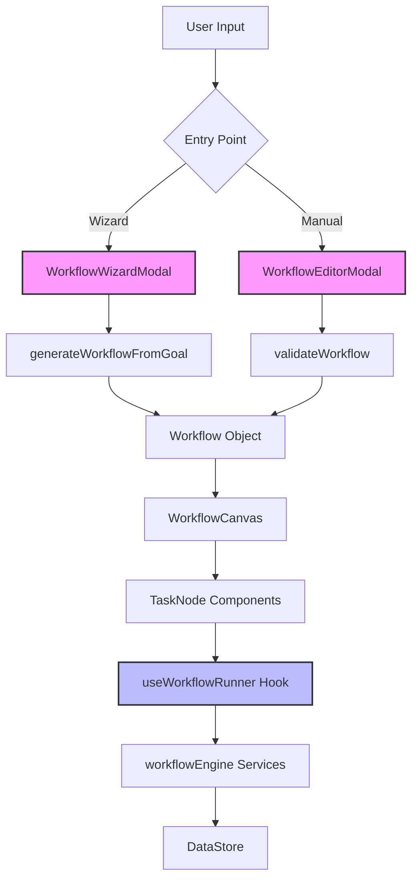

<details>
<summary>Relevant source files</summary>

The following files were used as context for generating this wiki page:
- [src/components/lab/modals/WorkflowWizardModal.tsx](src/components/lab/modals/WorkflowWizardModal.tsx)
- [src/components/lab/modals/WorkflowEditorModal.tsx](src/components/lab/modals/WorkflowEditorModal.tsx)
- [src/components/lab/modals/TaskDetailModal.tsx](src/components/lab/modals/TaskDetailModal.tsx)
- [src/services/workflowService.ts](src/services/workflowService.ts)
- [src/components/lab/TaskNode.tsx](src/components/lab/TaskNode.tsx)
- [src/hooks/useWorkflowRunner.ts](src/hooks/useWorkflowRunner.ts)
- [src/components/lab/PromptLabPage.tsx](src/components/lab/PromptLabPage.tsx)
- [src/constants.ts](src/constants.ts)

</details>

# Extending Workflows

## Introduction

The "Extending Workflows" mechanism in this system provides two distinct pathways for constructing computational pipelines: the wizard-assisted generation and the manual graph construction. The system is architecturally centered around a visual canvas (`WorkflowCanvas`) that renders a Directed Acyclic Graph (DAG) of tasks. Extending a workflow involves either instantiating new tasks, configuring existing task properties, or orchestrating the execution of the graph via the `useWorkflowRunner` hook. The system relies heavily on the `@google/genai` library for schema definitions and the `reactflow` library for graph rendering. There is a structural coupling between the UI components (`WorkflowWizardModal`, `WorkflowEditorModal`) and the state management logic (`useWorkflowRunner`), which tightly integrates the visual representation with the execution engine.

## Architecture Overview

The workflow extension mechanism is distributed across multiple components that interact through a shared state model defined in the `types` file. The flow begins with user interaction in the UI, which triggers state updates in the store or hooks, eventually leading to service calls for generation or validation.



## Workflow Creation Mechanisms

### Wizard-Assisted Generation

The `WorkflowWizardModal` component implements a state machine to guide users from natural language input to a structured workflow. The process involves a user goal string, a loading state, and a refinement step that delegates to the `WorkflowEditorModal`.

**State Machine:**
The modal transitions through four distinct steps:
1.  `input`: User enters a goal.
2.  `loading`: System attempts to generate a workflow.
3.  `refinement`: User reviews and edits the generated workflow.
4.  `error`: Generation fails.

**Mechanism:**
When the user submits a goal, the `handleGenerate` function calls `generateWorkflowFromGoal(goal)`. If successful, the state transitions to `refinement`, where the generated workflow is passed to `WorkflowEditorModal` for editing. If the generation fails, the state transitions to `error` and displays the error message.

Sources: [WorkflowWizardModal.tsx#L15-L47]()

### Manual Graph Construction

The `WorkflowEditorModal` provides a manual interface for extending workflows. It allows users to add, remove, and update tasks within a workflow object. This component is responsible for maintaining the integrity of the workflow structure before it is passed to the canvas.

**Task Instantiation:**
When a new task is added, the system generates an empty task object using the `getEmptyTask` helper function. This function populates the task with default values for the provider, model, and global parameters.

**Validation:**
Before saving, the workflow must pass validation checks. The `validateWorkflow` function is called to ensure the graph structure is valid (e.g., no circular dependencies, valid node types).

Sources: [WorkflowEditorModal.tsx#L1-L100]()

## Task Configuration and Types

Extending a workflow requires configuring individual tasks. Tasks are the atomic units of the graph and possess a specific schema defined by the `Task` type.

### Task Properties

Each task instance contains the following attributes:

| Property | Type | Description | Source |
| :--- | :--- | :--- | :--- |
| `id` | `string` | Unique identifier for the task. | [WorkflowEditorModal.tsx#L85-L90]() |
| `name` | `string` | Human-readable name of the task. | [WorkflowEditorModal.tsx#L85-L90]() |
| `type` | `TaskType` | Enum defining the task's functionality. | [WorkflowEditorModal.tsx#L85-L90]() |
| `dependencies` | `string[]` | Array of task IDs this task depends on. | [TaskDetailModal.tsx#L10-L15]() |
| `inputKeys` | `string[]` | Keys to retrieve data from the data store. | [TaskDetailModal.tsx#L10-L15]() |
| `outputKey` | `string` | Key to store the result in the data store. | [TaskDetailModal.tsx#L10-L15]() |
| `promptTemplate` | `string` | Template string for LLM prompts. | [TaskDetailModal.tsx#L10-L15]() |
| `agentConfig` | `AgentConfig` | Provider, model, and temperature settings. | [WorkflowEditorModal.tsx#L85-L90]() |
| `functionBody` | `string` | JavaScript code for transform nodes. | [TaskDetailModal.tsx#L10-L15]() |

### Supported Task Types

The system supports six distinct task types, which dictate the execution behavior of the node:

| Task Type | Description | Source |
| :--- | :--- | :--- |
| `DATA_INPUT` | Accepts raw user input (text, image, file). | [WorkflowEditorModal.tsx#L85-L90]() |
| `GEMINI_PROMPT` | Invokes an LLM using the Gemini provider. | [WorkflowEditorModal.tsx#L85-L90]() |
| `IMAGE_ANALYSIS` | Analyzes image data. | [workflowService.ts#L10-L15]() |
| `TRANSFORM` | Executes JavaScript code in a sandboxed environment. | [workflowService.ts#L10-L15]() |
| `SIMULATION` | Placeholder for simulation logic. | [workflowService.ts#L10-L15]() |
| `VISUALIZATION` | Renders charts or visual outputs. | [workflowService.ts#L10-L15]() |

## Execution and State Management

Once a workflow is constructed, the `useWorkflowRunner` hook manages its execution. This hook is responsible for resetting task states, staging user inputs, and orchestrating the topological execution of the graph.

### Execution Flow

The execution logic relies on the `workflowEngine` service, which provides `topologicalSort` and `executeTask` functions. The hook manages a `TaskStateMap` to track the status of each task (PENDING, RUNNING, COMPLETED, FAILED).

**State Transitions:**
1.  **Reset:** Clears previous execution data and sets all tasks to `PENDING`.
2.  **Stage Input:** Sets the initial user input into the data store.
3.  **Run:** Iterates through tasks in topological order. If a task's dependencies are satisfied, it executes. The execution result is stored in the `dataStore` under the task's `outputKey`.

**Error Handling:**
If a task fails during execution, the hook updates the task's state to `FAILED` and captures the error message. The `TaskNode` component renders this error state visually.

Sources: [useWorkflowRunner.ts#L1-L80]()

### Node Rendering

The `TaskNode` component is responsible for visualizing the state of a task within the graph. It displays the task's name, status icon, duration, and any error messages.

**Status Visualization:**
-   **Pending:** Default state.
-   **Running:** Spinner animation.
-   **Completed:** Checkmark icon.
-   **Failed:** Red error text.

Sources: [TaskNode.tsx#L1-L80]()

## Data Flow and Dependencies

The system uses a centralized `DataStore` to pass data between tasks. The `inputKeys` of a task specify which keys from the data store should be injected into its execution context.

**Dependency Resolution:**
The `topologicalSort` function determines the execution order. A task cannot run until all tasks listed in its `dependencies` array have completed and their outputs are available in the data store.

**Critical Structural Observation:**
The `WorkflowWizardModal` delegates the refinement step to `WorkflowEditorModal`. This creates a tight coupling where the wizard cannot exist without the editor. Furthermore, the `workflowService.ts` imports `Type` from `@google/genai` and defines a schema for workflows. This indicates that the system's internal data structures are validated against external Google GenAI types, which is a significant dependency that could limit flexibility if the external library changes.

Sources: [WorkflowWizardModal.tsx#L40-L45](), [workflowService.ts#L1-L15]()

## Code Snippets

### Empty Task Generation

The following code snippet demonstrates how the system initializes a new task with default values. This is the mechanism used when extending a workflow by adding a new node.

```typescript
const getEmptyTask = (defaultProvider: AIProvider, defaultModel: string, globalParams: any): Omit<Task, 'id'> => ({
    name: 'New Task',
    description: '',
    type: TaskType.GEMINI_PROMPT,
    dependencies: [],
    inputKeys: [],
    outputKey: 'newResult',
    promptTemplate: '',
    agentConfig: {
        provider: defaultProvider,
        model: defaultModel,
        temperature: globalParams.temperature,
        topK: globalParams.topK,
        topP: globalParams.topP,
    },
    functionBody: '',
    staticValue: '',
    dataKey: '',
});
```

Sources: [WorkflowEditorModal.tsx#L1-L25]()

### Workflow Wizard State Machine

The wizard component manages the user journey from natural language input to a structured workflow object.

```typescript
const handleGenerate = async () => {
    if (!goal.trim()) {
        setErrorMessage('Please describe your workflow goal.');
        return;
    }
    setStep('loading');
    setErrorMessage('');
    try {
        const workflow = await generateWorkflowFromGoal(goal);
        setGeneratedWorkflow(workflow);
        setStep('refinement');
    } catch (error: any) {
        setErrorMessage(error.message || 'An unknown error occurred.');
        setStep('error');
    }
};
```

Sources: [WorkflowWizardModal.tsx#L30-L47]()

## Conclusion

Extending Workflows in this system is a dual-mode operation: automated generation via a wizard and manual graph construction via an editor. The architecture relies on a robust state management layer (`useWorkflowRunner`) to orchestrate the execution of a DAG of tasks. The system enforces strict typing and schema validation, though it introduces a critical dependency on Google's GenAI library for schema definitions. The separation of concerns between the UI components and the execution engine is present, but the wizard-editor coupling suggests a rigid workflow for initial construction. The sandboxed execution of transform nodes provides a necessary security boundary, allowing for dynamic JavaScript logic without compromising the browser environment.