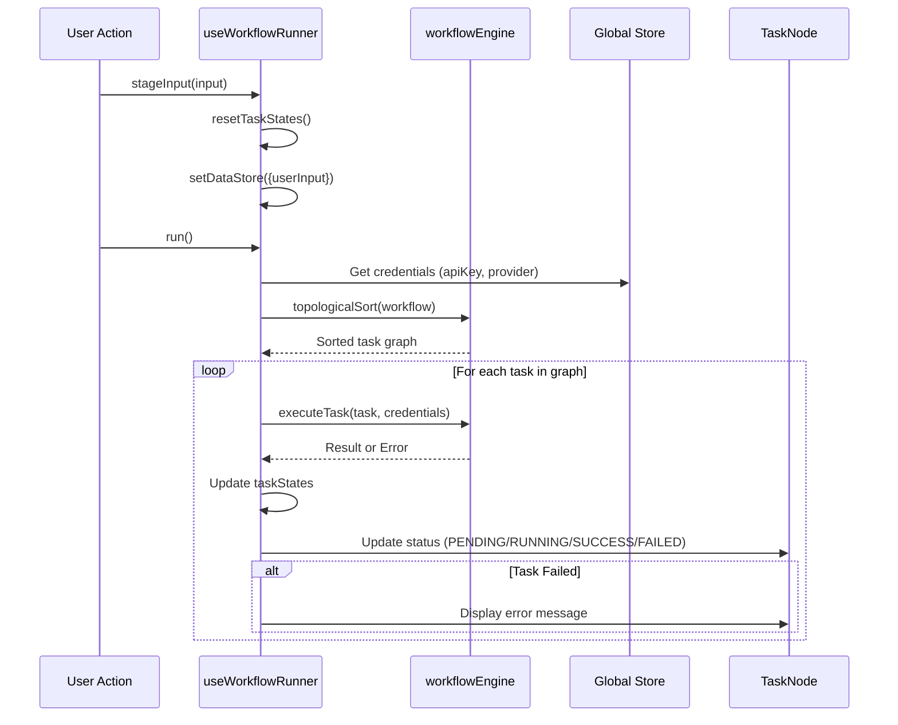
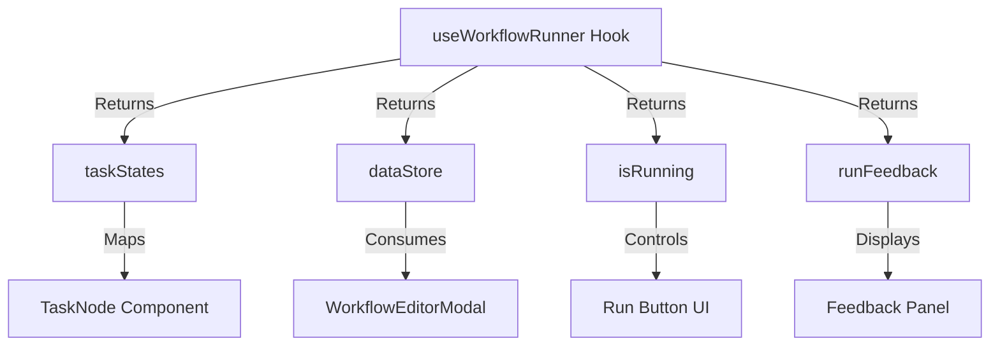

<details>
<summary>Relevant source files</summary>

The following files were used as context for generating this wiki page:
- [src/hooks/useWorkflowRunner.ts](src/hooks/useWorkflowRunner.ts)
- [src/constants.ts](src/constants.ts)
- [src/components/lab/TaskNode.tsx](src/components/lab/TaskNode.tsx)
- [src/components/lab/modals/WorkflowWizardModal.tsx](src/components/lab/modals/WorkflowWizardModal.tsx)
- [src/components/PromptFormModal.tsx](src/components/PromptFormModal.tsx)
- [src/components/Header.tsx](src/components/Header.tsx)

</details>

# Custom Hooks & Utilities

## Introduction

The "Custom Hooks & Utilities" module provides the reactive logic layer for the SFL Prompt Studio workflow engine. The system architecture relies on a custom React hook, `useWorkflowRunner`, to manage the lifecycle of workflow execution, including state synchronization, data persistence, and asynchronous task orchestration. This module is structurally coupled to a global state store for credential management and external workflow engine services for topological sorting and task execution. Utilities are primarily defined as static data structures within constants files and service-level abstractions within the workflow engine, rather than as modular utility functions.

## Detailed Sections

### 1. useWorkflowRunner Hook Architecture

The `useWorkflowRunner` hook serves as the primary controller for workflow execution. It encapsulates the logic required to transform a static `Workflow` definition into an active, stateful execution environment. The hook does not manage UI rendering directly but provides the state and control functions required by the workflow visualization components (`TaskNode`, `WorkflowEditorModal`).

**State Management**
The hook maintains four distinct state variables to track the execution environment:
1.  `dataStore`: A state object (`DataStore`) that persists data generated by workflow tasks.
2.  `taskStates`: A map (`TaskStateMap`) tracking the status of individual tasks (PENDING, RUNNING, SUCCESS, FAILED).
3.  `isRunning`: A boolean flag indicating the active execution state.
4.  `runFeedback`: An array of strings providing execution feedback or error messages.

**Dependencies and Store Integration**
The hook imports `useStore` to access global credentials (`userApiKeys`, `defaultProvider`, `defaultModel`). This coupling implies that the hook cannot function without valid configuration in the global store, creating a dependency chain where the hook is stateless regarding credentials. The hook also imports `topologicalSort` and `executeTask` from the `workflowEngine` service, treating them as external black-box functions for graph traversal and node execution.

**Execution Control**
The hook exposes three primary control functions:
-   `reset`: Clears all task states and data store.
-   `stageInput`: Initializes the workflow with user input and resets states.
-   `run`: Triggers the execution pipeline. The implementation of this function relies on the `workflowEngine` services to process the task graph.

**Critical Structural Observation:**
The separation of `resetTaskStates` (which only resets status to PENDING) and `reset` (which also clears the data store) creates a potential for inconsistent state management if the two functions are called out of sequence. The `resetTaskStates` function iterates through the `workflow.tasks` array to initialize the state map, indicating a dependency on the workflow definition being immutable during execution.

```typescript
// State initialization pattern observed in hook
const [dataStore, setDataStore] = useState<DataStore>({});
const [taskStates, setTaskStates] = useState<TaskStateMap>({});
const [isRunning, setIsRunning] = useState(false);
const [runFeedback, setRunFeedback] = useState<string[]>([]);

// State reset logic
const resetTaskStates = useCallback(() => {
    if (!workflow) {
        setTaskStates({});
        return;
    }
    const initialStates: TaskStateMap = {};
    for (const task of workflow.tasks) {
        initialStates[task.id] = { status: TaskStatus.PENDING };
    }
    setTaskStates(initialStates);
    setRunFeedback([]);
}, [workflow]);
```

### 2. Task Status Lifecycle

The system defines a strict enumeration of task states to visualize execution progress. These states are mapped directly to UI rendering logic in the `TaskNode` component. The lifecycle follows a linear progression: PENDING → RUNNING → SUCCESS/FAILED.

**Status Enumerations**
-   `PENDING`: Initial state, indicating the task is queued.
-   `RUNNING`: Indicates the task is currently executing.
-   `SUCCESS`: Indicates successful completion.
-   `FAILED`: Indicates failure, with an associated error message.

**Error Handling**
The system implements error surface mechanisms. When a task fails, the `TaskNode` component renders an error message derived from the `state.error` property. The `useWorkflowRunner` hook does not explicitly handle error propagation to the `runFeedback` array in the provided snippets, suggesting that error handling is primarily the responsibility of the `executeTask` service function.

### 3. Constants and Static Data

The `constants.ts` file defines the foundational data structures for the application, serving as a registry for default workflows and prompts. These constants are used for initialization and provide the baseline configuration for the workflow engine.

**DEFAULT_WORKFLOWS**
This array defines a collection of pre-configured workflow templates. Each object contains an `id`, `name`, `description`, `isDefault` flag, and a `tasks` array. The `tasks` array defines the node structure of the workflow, including input mappings and output keys. This structure implies that workflows are declarative definitions rather than procedural code.

**DEFAULT_PROMPTS**
This array defines a library of sample prompts structured according to the SFL (Structured Format Language) schema. Each prompt object contains metadata fields (`id`, `title`, `createdAt`, `updatedAt`) and SFL component fields (`sflField`, `sflTenor`, `sflMode`). This data structure is utilized by the `PromptFormModal` for editing and testing.

### 4. Workflow Wizard Utility

The `WorkflowWizardModal` component provides a natural language interface for workflow generation. It abstracts the complexity of graph construction by allowing users to input a goal, which is then processed by the `generateWorkflowFromGoal` service function.

**Wizard State Machine**
The modal manages a state machine with four discrete steps:
1.  `input`: User enters the goal.
2.  `loading`: Service is processing the request.
3.  `refinement`: User reviews the generated workflow.
4.  `error`: Service returned an error.

**Interaction Pattern**
The component exposes `onSave` and `onClose` props, indicating that the generated workflow is passed up to a parent component for persistence. The modal does not handle workflow storage logic directly.

## Mermaid Diagrams

### Workflow Execution Sequence



### Data Flow: Hook to Component



## Tables

### useWorkflowRunner State Properties

| Property | Type | Purpose | Source |
| :--- | :--- | :--- | :--- |
| `dataStore` | `DataStore` | Persistent storage for workflow outputs | [src/hooks/useWorkflowRunner.ts#L18](src/hooks/useWorkflowRunner.ts#L18) |
| `taskStates` | `TaskStateMap` | Tracks execution status of individual tasks | [src/hooks/useWorkflowRunner.ts#L20](src/hooks/useWorkflowRunner.ts#L20) |
| `isRunning` | `boolean` | Indicates if the workflow is currently executing | [src/hooks/useWorkflowRunner.ts#L22](src/hooks/useWorkflowRunner.ts#L22) |
| `runFeedback` | `string[]` | Array of feedback messages or errors | [src/hooks/useWorkflowRunner.ts#L24](src/hooks/useWorkflowRunner.ts#L24) |

### Task Status Lifecycle

| Status | Description | UI Representation | Error Handling |
| :--- | :--- | :--- | :--- |
| `PENDING` | Task is queued but not started | Initial state | N/A |
| `RUNNING` | Task is currently executing | Spinner or progress indicator | N/A |
| `SUCCESS` | Task completed successfully | Checkmark or success icon | N/A |
| `FAILED` | Task execution failed | Error message display | Displays `state.error` | [src/components/lab/TaskNode.tsx#L40-L45](src/components/lab/TaskNode.tsx#L40-L45) |

## Code Snippets

### Hook Initialization and Dependencies

The hook demonstrates a dependency on the global store for configuration and external services for execution logic. The structure suggests a lack of encapsulation regarding credential management.

```typescript
import { useState, useCallback } from 'react';
import { Workflow, DataStore, TaskStateMap, TaskStatus, Task, PromptSFL, StagedUserInput } from '../types';
import { topologicalSort, executeTask } from '../services/workflowEngine';
import { useStore } from '../store/useStore';

export const useWorkflowRunner = (workflow: Workflow | null, prompts: PromptSFL[]) => {
    const { userApiKeys, defaultProvider, defaultModel } = useStore();
    const [dataStore, setDataStore] = useState<DataStore>({});
    const [taskStates, setTaskStates] = useState<TaskStateMap>({});
    const [isRunning, setIsRunning] = useState(false);
    const [runFeedback, setRunFeedback] = useState<string[]>([]);
```

### Constants Data Structure

The constants file defines the schema for workflows and prompts, establishing the contract for the workflow engine.

```typescript
export const DEFAULT_WORKFLOWS: Workflow[] = [
  {
    id: "wf-default-1",
    name: "Analyze and Summarize Article",
    description: "Takes an article from user input, analyzes its sentiment, and provides a concise summary.",
    isDefault: true,
    tasks: [
      {
        id: "task-1",
        name: "User Input Article",
        description: "Accepts the article text from the user.",
        type: TaskType.DATA_INPUT,
```

## Conclusion

The "Custom Hooks & Utilities" module is structurally centered around the `useWorkflowRunner` hook, which acts as a state manager for workflow execution. The system relies on a declarative data model defined in constants to drive the execution engine. A critical structural observation is the tight coupling between the hook and the global store for API credentials, which limits the reusability of the hook in environments where credentials are not managed centrally. Furthermore, the error handling logic appears to be partially delegated to external services, with the hook serving primarily as a coordinator rather than a fault-tolerant controller.