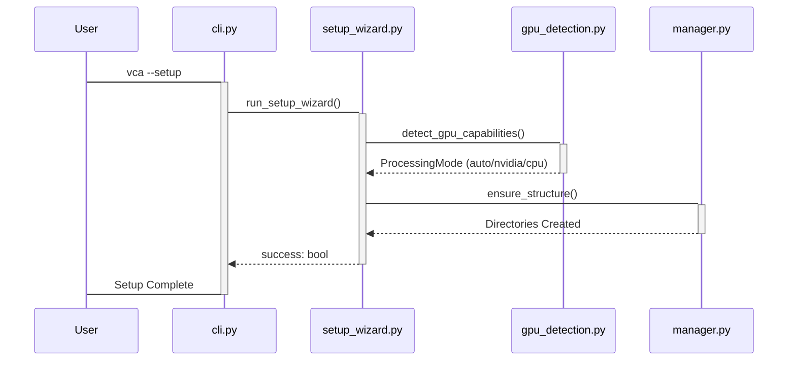
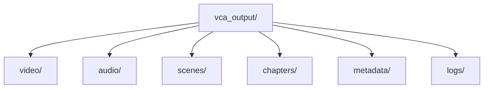

<details>
<summary>Relevant source files</summary>

The following files were used as context for generating this wiki page:
- [src/video_chapter_automater/setup_wizard.py](https://github.com/b08x/video-chapter-automater/blob/main/src/video_chapter_automater/setup_wizard.py)
- [src/video_chapter_automater/cli.py](https://github.com/b08x/video-chapter-automater/blob/main/src/video_chapter_automater/cli.py)
- [src/video_chapter_automater/main.py](https://github.com/b08x/video-chapter-automater/blob/main/src/video_chapter_automater/main.py)
- [src/video_chapter_automater/output/manager.py](https://github.com/b08x/video-chapter-automater/blob/main/src/video_chapter_automater/output/manager.py)
- [src/video_chapter_automater/pipeline/config.py](https://github.com/b08x/video-chapter-automater/blob/main/src/video_chapter_automater/pipeline/config.py)
- [demo_setup.py](https://github.com/b08x/video-chapter-automater/blob/main/demo_setup.py)
</details>

# Getting Started

## Introduction

The "Getting Started" phase of the Video Chapter Automater (VCA) is a multi-stage initialization process designed to align hardware capabilities with software requirements. The system employs a TUI-based setup wizard to bridge the gap between raw video files and the structured pipeline execution. This phase functions as a gatekeeper, ensuring that dependencies like FFmpeg and GPU drivers are present before any heavy lifting begins.

## System Entry Points and Orchestration

Initialization occurs through two primary paths: the interactive `SetupWizard` for environment configuration and the `CLI` for execution. The `SetupWizard` acts as a stateful guide, while the `CLI` serves as the stateless entry point for processing.

### Execution Flow

The following diagram illustrates the sequence from initial command to system readiness.


Sources: [src/video_chapter_automater/cli.py:#L30-L45](https://github.com/b08x/video-chapter-automater/blob/main/src/video_chapter_automater/cli.py#L30-L45), [src/video_chapter_automater/setup_wizard.py:#L68-L85](https://github.com/b08x/video-chapter-automater/blob/main/src/video_chapter_automater/setup_wizard.py#L68-L85)

## Configuration and Preferences

The system relies on a `UserPreferences` dataclass to persist environmental state. Curiously, while the system promotes "automation," it requires significant manual validation during this phase to ensure the `scene_detection_threshold` and `gpu_preference` are sane.

| Field | Type | Default | Purpose |
| :--- | :--- | :--- | :--- |
| `installation_type` | Enum | STANDARD | Defines dependency depth |
| `gpu_preference` | str | "auto" | Overrides hardware detection |
| `output_format` | str | "mp4" | Global target container |
| `scene_detection_threshold` | float | 30.0 | Sensitivity for chapter breaks |

Sources: [src/video_chapter_automater/setup_wizard.py:#L88-L105](https://github.com/b08x/video-chapter-automater/blob/main/src/video_chapter_automater/setup_wizard.py#L88-L105), [src/video_chapter_automater/pipeline/config.py:#L85-L105](https://github.com/b08x/video-chapter-automater/blob/main/src/video_chapter_automater/pipeline/config.py#L85-L105)

## The Setup Wizard Mechanism

The `SetupWizard` is structured as a series of `SetupStep` enumerations. It utilizes the `rich` library to provide visual feedback during high-latency operations like dependency installation and GPU detection.

### Setup Steps Logic

1.  **Welcome**: Displays branding and overview.
2.  **System Check**: Validates Python environment and external binaries.
3.  **GPU Detection**: Probes for NVIDIA (CUDA), Intel, or CPU fallbacks.
4.  **Configuration**: Captures user-defined paths and processing thresholds.
5.  **Validation**: Performs a dry-run of the output directory creation.

Sources: [src/video_chapter_automater/setup_wizard.py:#L75-L85](https://github.com/b08x/video-chapter-automater/blob/main/src/video_chapter_automater/setup_wizard.py#L75-L85), [demo_setup.py:#L55-L75](https://github.com/b08x/video-chapter-automater/blob/main/demo_setup.py#L55-L75)

## Output Directory Architecture

A critical part of "Getting Started" is the instantiation of the `OutputManager`. The system enforces a rigid directory structure to prevent file collision during the multi-stage pipeline. It's a bit of a rigid setup—if the directory isn't there, the system just forces it into existence.


Sources: [src/video_chapter_automater/output/manager.py:#L95-L115](https://github.com/b08x/video-chapter-automater/blob/main/src/video_chapter_automater/output/manager.py#L95-L115)

### Structural Observation

The `OutputManager` creates a `README.txt` within the output directory (Sources: [src/video_chapter_automater/output/manager.py:#L140](https://github.com/b08x/video-chapter-automater/blob/main/src/video_chapter_automater/output/manager.py#L140)). This serves as a runtime manifest, explaining the naming convention `{video_name}{suffix}.{extension}`. The system effectively self-documents its output as it initializes.

## Pipeline Initialization

Once the environment is validated, the `PipelineConfig` is built. This configuration defines the `ExecutionMode` (SEQUENTIAL, PARALLEL, or RESILIENT). While the code defines a `PARALLEL` mode, the orchestrator notes it as a "future enhancement," effectively defaulting to sequential execution despite the configuration's apparent flexibility. This is a classic architectural "placeholder" that adds complexity without current functional utility.

```python
# From src/video_chapter_automater/pipeline/config.py

class ExecutionMode(Enum):
    SEQUENTIAL = "sequential"
    PARALLEL = "parallel" # Future enhancement
    RESILIENT = "resilient"
```
Sources: [src/video_chapter_automater/pipeline/config.py:#L35-L45](https://github.com/b08x/video-chapter-automater/blob/main/src/video_chapter_automater/pipeline/config.py#L35-L45), [src/video_chapter_automater/pipeline/orchestrator.py:#L85-L95](https://github.com/b08x/video-chapter-automater/blob/main/src/video_chapter_automater/pipeline/orchestrator.py#L85-L95)

## Conclusion

"Getting Started" in VCA is a process of transitioning from a clean environment to a stateful, hardware-aware processing engine. It centers on the `SetupWizard` for configuration and the `OutputManager` for structural readiness. The system's reliance on `rich` for TUI feedback indicates a design priority on user interaction during the volatile setup phase, ensuring that the underlying pipeline has a stable foundation of directories and validated hardware paths.