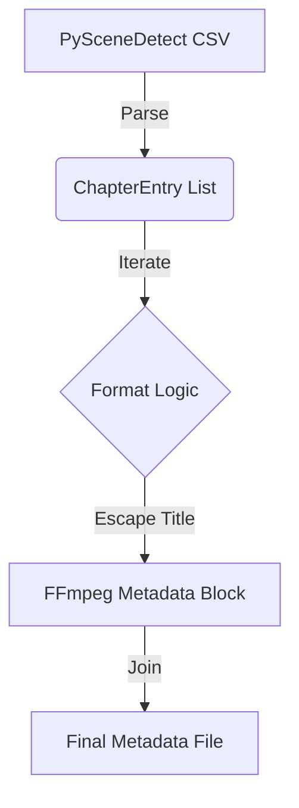
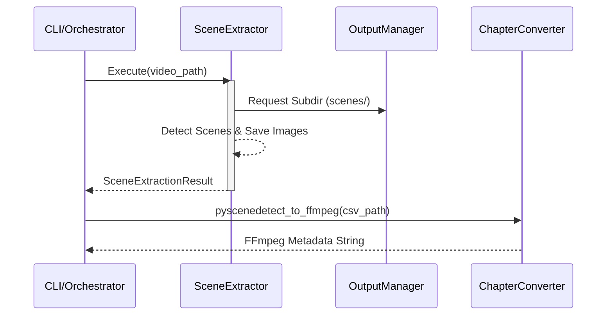

Relevant source files

The following files were used as context for generating this wiki page:
- [src/video_chapter_automater/chapconv.py](https://github.com/b08x/video-chapter-automater/blob/main/src/video_chapter_automater/chapconv.py)
- [src/video_chapter_automater/preprocessing/scene_extractor.py](https://github.com/b08x/video-chapter-automater/blob/main/src/video_chapter_automater/preprocessing/scene_extractor.py)
- [src/video_chapter_automater/output/manager.py](https://github.com/b08x/video-chapter-automater/blob/main/src/video_chapter_automater/output/manager.py)
- [src/video_chapter_automater/pipeline/config.py](https://github.com/b08x/video-chapter-automater/blob/main/src/video_chapter_automater/pipeline/config.py)
- [src/video_chapter_automater/cli_pipeline.py](https://github.com/b08x/video-chapter-automater/blob/main/src/video_chapter_automater/cli_pipeline.py)

# Scene Detection & Chapter Conversion

## 1. Introduction

The "Scene Detection & Chapter Conversion" subsystem serves as the core analytical engine of the VideoChapterAutomater. Its primary mechanism is the transformation of raw visual temporal data into structured navigational metadata. This process involves detecting content-based boundaries via `PySceneDetect`, extracting representative visual frames with perceptual hash-based deduplication, and finally serializing these temporal markers into FFmpeg-compatible metadata. The system acts as a bridge between computer vision analysis and media container standards.

## 2. Scene Extraction Mechanism

Scene extraction is handled by the `SceneExtractor` class, which operates as a `PreprocessingOperation`. It relies on the `scenedetect` library to identify shifts in video content based on a configurable threshold.

### 2.1 Configuration and Validation

The extraction process is governed by `SceneExtractionConfig`, which defines the sensitivity and output characteristics of the detection.

| Attribute | Type | Default | Description |
| :--- | :--- | :--- | :--- |
| `num_images` | `int` | 3 | Images to extract per scene (Range: 1-9) |
| `threshold` | `float` | 27.0 | Content detection sensitivity |
| `dedup_threshold` | `int` | 5 | Hash similarity for deduplication (0-10) |
| `hash_algorithm` | `str` | "phash" | Algorithm: phash, dhash, or whash |
| `min_scene_length` | `float` | 0.5 | Minimum duration in seconds |

Sources: `[src/video_chapter_automater/preprocessing/scene_extractor.py:#L36-L55]`

### 2.2 Deduplication Logic

A notable structural pattern is the use of `PerceptualHashStrategy` to eliminate redundant frames. The system doesn't just dump every frame; it aggressively filters "bullshit" near-duplicate images that provide no unique visual information for a chapter. This deduplication is critical when `num_images` is set high, ensuring the `scenes/` directory remains somewhat sane.

Sources: `[src/video_chapter_automater/preprocessing/scene_extractor.py:#L105-L115]`

## 3. Chapter Conversion and Serialization

Once scenes are detected, the `ChapterConverter` translates the CSV-based output of the detector into a format FFmpeg can embed.

### 3.1 Data Flow: CSV to FFmpeg

The conversion logic follows a strict linear progression:
1. **Parse**: `parse_pyscenedetect_csv` reads the scene boundaries.
2. **Model**: Data is encapsulated into `ChapterEntry` objects.
3. **Format**: `to_ffmpeg_format` generates the `;FFMETADATA1` compliant string.

Sources: `[src/video_chapter_automater/chapconv.py:#L32-L65]`

### 3.2 The FFmpeg Metadata Schema

The `ChapterEntry` class ensures that timebases are normalized to `1/1000` (milliseconds), which is the standard expected by FFmpeg for chapter markers. It also handles the escaping of characters like `=` and newlines in titles to prevent the metadata parser from shitting itself during the embedding phase.

Sources: `[src/video_chapter_automater/chapconv.py:#L39-L55]`

## 4. System Interaction and Pipeline Integration

The scene detection stage is integrated into a larger `PipelineConfig` as a `PipelineStage`.

### 4.1 Pipeline Sequence

The `cli_pipeline.py` orchestrates the flow. While scene extraction is technically independent, the pipeline structure suggests it often follows video re-encoding to ensure the detector works on a consistent codec/bitrate.

Sources: `[src/video_chapter_automater/cli_pipeline.py:#L45-L55]`, `[src/video_chapter_automater/pipeline/config.py:#L22-L30]`

### 4.2 Output Organization

The `OutputManager` provides a centralized structure for the artifacts generated during this process. Despite the modularity of the code, the `OutputManager` enforces a rigid directory hierarchy that the `SceneExtractor` must respect.

| Output Type | Directory | Content Description |
| :--- | :--- | :--- |
| `SCENES` | `scenes/{video_name}/` | Deduplicated PNG/JPG frame captures |
| `CHAPTERS` | `chapters/` | FFmpeg metadata files |
| `METADATA` | `metadata/` | JSON manifests and processing stats |

Sources: `[src/video_chapter_automater/output/manager.py:#L100-L115]`

## 5. Structural Observations

The system exhibits a "resilient yet dependent" architecture. For instance, `ChapterConverter` is designed as a standalone utility, yet its primary input method `parse_pyscenedetect_csv` is hard-coded to expect the specific CSV headers produced by `PySceneDetect`. If the detector's output format changes by even a single column header, the "independent" converter becomes useless. 

Furthermore, the `SceneExtractor` includes a `SCENEDETECT_AVAILABLE` check, but the `cli.py` and `cli_pipeline.py` treat the presence of these dependencies as a prerequisite for even starting the application. This creates a facade of optionality that is contradicted by the operational reality of the CLI.

Sources: `[src/video_chapter_automater/chapconv.py:#L68-L75]`, `[src/video_chapter_automater/cli.py:#L35-L45]`

## 6. Conclusion

The Scene Detection & Chapter Conversion subsystem is the primary translator of visual change into logical structure within the repository. It successfully decouples the high-level detection logic from the low-level metadata serialization, provided the intermediary CSV format remains stable. Its structural significance lies in its ability to reduce gigabytes of video data into a few kilobytes of deduplicated images and metadata markers, facilitating efficient video navigation.