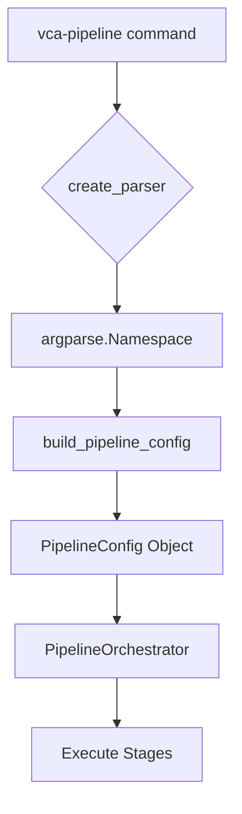
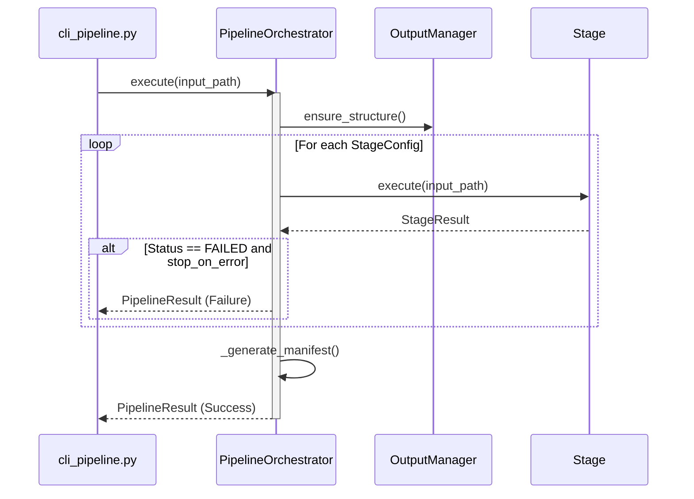

Relevant source files

The following files were used as context for generating this wiki page:
- [src/video_chapter_automater/cli.py](https://github.com/b08x/video-chapter-automater/blob/main/src/video_chapter_automater/cli.py)
- [src/video_chapter_automater/cli_pipeline.py](https://github.com/b08x/video-chapter-automater/blob/main/src/video_chapter_automater/cli_pipeline.py)
- [src/video_chapter_automater/main.py](https://github.com/b08x/video-chapter-automater/blob/main/src/video_chapter_automater/main.py)
- [src/video_chapter_automater/pipeline/orchestrator.py](https://github.com/b08x/video-chapter-automater/blob/main/src/video_chapter_automater/pipeline/orchestrator.py)
- [src/video_chapter_automater/pipeline/config.py](https://github.com/b08x/video-chapter-automater/blob/main/src/video_chapter_automater/pipeline/config.py)
- [src/video_chapter_automater/setup_wizard.py](https://github.com/b08x/video-chapter-automater/blob/main/src/video_chapter_automater/setup_wizard.py)
- [src/video_chapter_automater/output/manager.py](https://github.com/b08x/video-chapter-automater/blob/main/src/video_chapter_automater/output/manager.py)

# CLI Reference

## Introduction

The Command Line Interface (CLI) for Video Chapter Automater (VCA) serves as the primary entry point for orchestrating video preprocessing and chapter generation workflows. The system exposes two distinct operational paths: a standard entry point (`vca`) and an advanced pipeline controller (`vca-pipeline`). These interfaces manage the transition from user input to the internal execution engines, handling system validation, GPU detection, and multi-stage pipeline configuration.

Sources: `src/video_chapter_automater/cli.py`, `src/video_chapter_automater/cli_pipeline.py`

## Command Architecture and Entry Points

The system utilizes `argparse` to define its command-line surface. The entry points are bifurcated based on the complexity of the required task.

### Standard CLI (`vca`)

The standard CLI is designed for general-purpose execution, offering modes ranging from "simple" to "enhanced" TUI experiences. It manages high-level flags for system inspection (GPU info, configuration) and triggers the interactive setup wizard.

| Argument | Function | System Impact |
| :--- | :--- | :--- |
| `--setup` | `run_setup_wizard()` | Launches TUI for dependency and preference configuration. |
| `--gpu-info` | `show_gpu_info()` | Invokes GPU detection logic to report hardware capabilities. |
| `--simple` | Processing Mode Flag | Disables Rich TUI for minimal output. |
| `video_file` | Positional Argument | The primary input path for the `VideoProcessor`. |

Sources: `src/video_chapter_automater/cli.py:#L27-L55`, `src/video_chapter_automater/cli.py:#L66-L85`

### Pipeline CLI (`vca-pipeline`)

The pipeline CLI provides granular control over the `PipelineOrchestrator`. It allows users to toggle specific stages such as video re-encoding, audio extraction, and scene detection.

Sources: `src/video_chapter_automater/cli_pipeline.py:#L62-L105`

## System Initialization and Setup Wizard

The `setup_wizard.py` module handles the initial state of the system. It uses an interactive TUI to validate the environment. Despite presenting itself as a "wizard," it functions as a hard gate for system dependencies like FFmpeg and GPU drivers.

The setup process follows a rigid state machine defined by the `SetupStep` Enum:
1. `WELCOME`
2. `SYSTEM_CHECK`
3. `GPU_DETECTION`
4. `INSTALLATION_TYPE`
5. `DEPENDENCY_INSTALL`
6. `CONFIGURATION`
7. `VALIDATION`
8. `COMPLETE`

Sources: `src/video_chapter_automater/setup_wizard.py:#L43-L52`

## Pipeline Orchestration Flow

When `vca-pipeline` is invoked, the `PipelineOrchestrator` manages the lifecycle of `Stage` objects. The flow is strictly sequential by default, though the code references a "RESILIENT" mode that supposedly continues on failure—a design choice that suggests a tolerance for partial data that might be fucking useless for subsequent stages.

Sources: `src/video_chapter_automater/pipeline/orchestrator.py:#L53-L100`, `src/video_chapter_automater/pipeline/orchestrator.py:#L210-L235`

## Configuration and Output Mapping

The CLI maps user flags to the `PipelineConfig` and `OutputManager`. The `OutputManager` creates a standardized directory structure, which is ironically documented via a `create_readme` method that writes a static string to a file—a mechanism that ensures the user is told what the directories are, even if the processing fails to populate them.

| Output Type | Directory | Description |
| :--- | :--- | :--- |
| `VIDEO` | `video/` | Re-encoded files (GPU accelerated). |
| `AUDIO` | `audio/` | 16kHz mono WAV for transcription. |
| `SCENES` | `scenes/` | Extracted images organized by video name. |
| `METADATA` | `metadata/` | JSON manifests and statistics. |

Sources: `src/video_chapter_automater/output/manager.py:#L15-L35`, `src/video_chapter_automater/pipeline/config.py:#L66-L85`

## Structural Observations

The CLI implementation reveals a heavy dependency on the `Rich` library for terminal presentation. In `cli.py`, the system attempts to import `Rich` and falls back to a `None` console, yet several subsequent logic paths assume a functional UI, creating a potential for runtime friction if the environment is stripped. 

Furthermore, the `PipelineOrchestrator` includes a `PARALLEL` execution mode labeled as a "future enhancement," meaning the current CLI flags for parallel processing in `UserPreferences` are effectively cosmetic placeholders that do not influence the actual execution logic in the provided source.

Sources: `src/video_chapter_automater/cli.py:#L11-L24`, `src/video_chapter_automater/pipeline/orchestrator.py:#L88-L92`, `src/video_chapter_automater/setup_wizard.py:#L65-L75`

## Conclusion

The CLI Reference defines a system that prioritizes structured output and user-facing feedback through TUI components. The interaction between `cli_pipeline.py` and `PipelineOrchestrator` ensures that video processing is treated as a series of discrete, configurable stages, while the `OutputManager` enforces a rigid file system hierarchy for all generated artifacts.