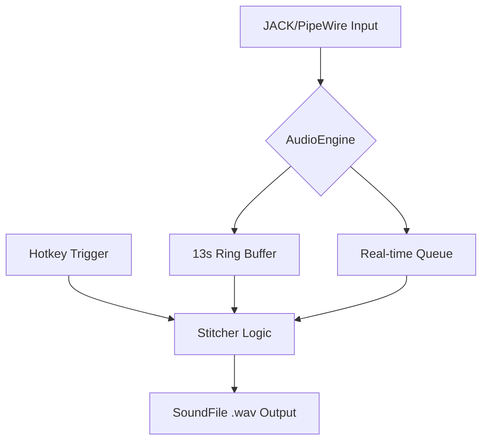
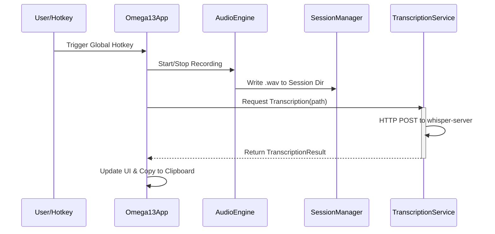

Relevant source files

The following files were used as context for generating this wiki page:
- [src/omega13/app.py](https://github.com/b08x/omega-13/blob/main/src/omega13/app.py)
- [src/omega13/audio.py](https://github.com/b08x/omega-13/blob/main/src/omega13/audio.py)
- [src/omega13/session.py](https://github.com/b08x/omega-13/blob/main/src/omega13/session.py)
- [src/omega13/transcription.py](https://github.com/b08x/omega-13/blob/main/src/omega13/transcription.py)
- [src/omega13/config.py](https://github.com/b08x/omega-13/blob/main/src/omega13/config.py)
- [README.md](https://github.com/b08x/omega-13/blob/main/README.md)

# Introduction to Omega-13

Omega-13 is a retroactive audio recording and transcription system designed to capture audio data that occurred prior to the initiation of a recording command. The system operates as a terminal user interface (TUI) application that maintains a continuous rolling buffer of audio in memory, allowing users to "recover" the preceding 13 seconds of audio.

Sources: [README.md](https://github.com/b08x/omega-13/blob/main/README.md), [src/omega13/app.py](https://github.com/b08x/omega-13/blob/main/src/omega13/app.py)

## System Architecture and Mechanism

The system is built on a modular architecture where the `Omega13App` coordinates several specialized components. It utilizes the JACK/PipeWire audio infrastructure for low-latency audio capture and a local Docker-based Whisper server for AI transcription.

### Core Components

| Component | Responsibility |
| :--- | :--- |
| `AudioEngine` | Manages JACK client, maintains the 13-second ring buffer, and handles file writing. |
| `SessionManager` | Oversees session lifecycles, directory structures, and metadata persistence. |
| `TranscriptionService` | Interfaces with a local HTTP API to convert audio files into text. |
| `ConfigManager` | Handles persistent JSON-based settings and hardware port mappings. |
| `Omega13App` | Provides the Textual-based TUI and binds global hotkeys to system actions. |

Sources: [src/omega13/audio.py:#L18-L25](https://github.com/b08x/omega-13/blob/main/src/omega13/audio.py#L18-L25), [src/omega13/session.py](https://github.com/b08x/omega-13/blob/main/src/omega13/session.py), [src/omega13/config.py:#L11-L20](https://github.com/b08x/omega-13/blob/main/src/omega13/config.py#L11-L20), [src/omega13/app.py:#L45-L65](https://github.com/b08x/omega-13/blob/main/src/omega13/app.py#L45-L65)

## Audio Processing Flow

The `AudioEngine` maintains a `ring_buffer` using NumPy, which stores `float32` audio data. This buffer is constantly updated in the background. When a recording is triggered, the engine "stitches" the historical data from the ring buffer with the incoming real-time audio stream.

The "stitcher" logic is a clever way to handle the temporal shift, though it relies heavily on the `writer_thread` keeping up with the `record_queue`. If the queue overflows (maxsize=200), audio data is simply lost—a shitty but pragmatic constraint for a real-time system.

Sources: [src/omega13/audio.py:#L36-L55](https://github.com/b08x/omega-13/blob/main/src/omega13/audio.py#L36-L55), [README.md](https://github.com/b08x/omega-13/blob/main/README.md)

## Session and Transcription Lifecycle

Sessions are initially volatile, stored in `/tmp/omega13`. A session becomes permanent only when explicitly saved by the user. The transcription process is decoupled from recording; it occurs via an HTTP POST request to a local container.

### Interaction Sequence

The following diagram illustrates the sequence from hotkey trigger to clipboard update:

Sources: [src/omega13/app.py:#L120-L140](https://github.com/b08x/omega-13/blob/main/src/omega13/app.py#L120-L140), [src/omega13/transcription.py:#L45-L60](https://github.com/b08x/omega-13/blob/main/src/omega13/transcription.py#L45-L60), [README.md](https://github.com/b08x/omega-13/blob/main/README.md)

## Structural Observations and Inconsistencies

A notable structural pattern is the system's dependency on external environmental factors that are not strictly managed by the Python code. For instance:
- **Wayland Constraints:** The application cannot natively listen for global hotkeys under Wayland. It forces the user to manually configure a system-level shortcut to execute `omega13 --toggle`, which then pokes the running instance via a PID file. It’s a functional workaround that highlights the fragmented nature of Linux desktop automation.
- **Transcription Redundancy:** The `Session` class contains a word-based deduplication algorithm in `add_transcription`. This suggests that the underlying transcription service or the way audio is fed to it occasionally produces overlapping text segments, requiring the application layer to clean up the mess.
- **Silent Failures:** The `AudioEngine` checks for signal levels to prevent "empty" recordings. If the VU meter doesn't move, the capture is blocked. While this prevents disk bloat, it introduces a failure state where the user might think they are recording when they are not, simply because the input gain was too low.

Sources: [src/omega13/session.py:#L1-L30](https://github.com/b08x/omega-13/blob/main/src/omega13/session.py#L1-L30), [src/omega13/app.py:#L150-L170](https://github.com/b08x/omega-13/blob/main/src/omega13/app.py#L150-L170), [README.md](https://github.com/b08x/omega-13/blob/main/README.md)

## Configuration and Persistence

The `ConfigManager` defaults to `~/.config/omega13/config.json`. It tracks hardware-specific details like JACK input ports, which are essential because the app "listens to nothing" by default until the user maps ports in the UI.

| Field | Default Value | Description |
| :--- | :--- | :--- |
| `global_hotkey` | `<ctrl>+<alt>+space` | The sequence used for the TUI listener. |
| `server_url` | `http://localhost:8080` | The endpoint for the Whisper Docker container. |
| `buffer_duration` | 13 | Hardcoded constant for the "time machine" effect. |

Sources: [src/omega13/config.py:#L25-L40](https://github.com/b08x/omega-13/blob/main/src/omega13/config.py#L25-L40), [src/omega13/audio.py:#L14](https://github.com/b08x/omega-13/blob/main/src/omega13/audio.py#L14)

## Conclusion

Omega-13 is structurally defined by its role as a temporal bridge for audio. Its significance lies in the integration of high-performance audio buffering (JACK/NumPy) with high-latency AI processing (Whisper). The system exhibits a heavy reliance on local infrastructure (Docker, PID files, and specific JACK/PipeWire configurations), making it a specialized tool for Linux environments where such low-level control is accessible.