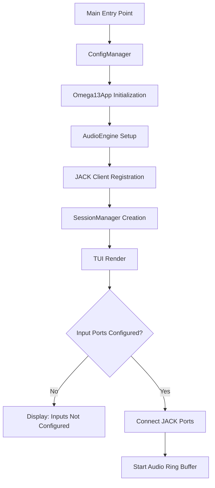
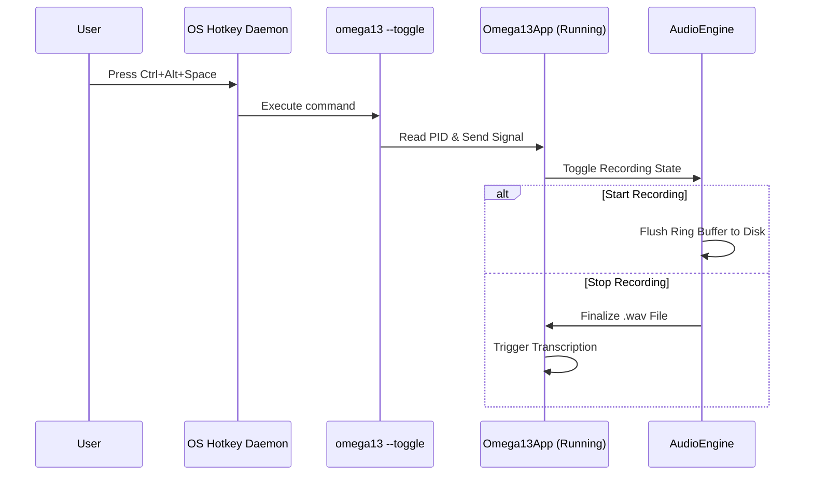

Relevant source files

The following files were used as context for generating this wiki page:
- [src/omega13/app.py](https://github.com/b08x/omega-13/blob/main/src/omega13/app.py)
- [src/omega13/config.py](https://github.com/b08x/omega-13/blob/main/src/omega13/config.py)
- [src/omega13/audio.py](https://github.com/b08x/omega-13/blob/main/src/omega13/audio.py)
- [src/omega13/session.py](https://github.com/b08x/omega-13/blob/main/src/omega13/session.py)
- [src/omega13/transcription.py](https://github.com/b08x/omega-13/blob/main/src/omega13/transcription.py)
- [README.md](https://github.com/b08x/omega-13/blob/main/README.md)

# Getting Started

## 1. Introduction
Omega-13 is a retroactive audio recording system designed to capture audio buffers from the past (defaulting to 13 seconds) and process them through a transcription pipeline. The system operates as a Terminal User Interface (TUI) application built on the Textual framework, coordinating between a JACK-based audio engine, a local or containerized Whisper transcription server, and a session management layer. Its primary role is to bridge the gap between continuous audio monitoring and on-demand archival/transcription.

Sources: [src/omega13/app.py:#L57-L80](), [README.md:#L76-L85]()

## 2. System Architecture and Initialization
The application initializes by loading persistent configurations and establishing a JACK client. The boot sequence reveals a dependency chain where the UI cannot effectively function without a valid audio backend, yet the system allows the UI to launch even if inputs are unconfigured.

### Component Interaction Flow
The following diagram illustrates the startup and input connection sequence:

Sources: [src/omega13/app.py:#L125-L150](), [src/omega13/audio.py:#L22-L40]()

### Core Components
| Component | Responsibility | Key Interaction |
| :--- | :--- | :--- |
| `ConfigManager` | Persists user settings (hotkeys, server URLs, paths) in `~/.config/omega13/config.json`. | Provides the `global_hotkey` and `server_url` to the app. |
| `AudioEngine` | Manages a `numpy`-based ring buffer and handles real-time audio capture via JACK. | Feeds peak levels to the `VUMeter` UI components. |
| `SessionManager` | Handles temporary storage in `/tmp/omega13` and permanent archival. | Triggers metadata syncing when transcriptions are added. |
| `TranscriptionService` | Interfaces with a `whisper-server` HTTP API for asynchronous processing. | Updates the `TranscriptionDisplay` upon completion or error. |

Sources: [src/omega13/config.py:#L14-L40](), [src/omega13/audio.py:#L18-L55](), [src/omega13/session.py:#L45-L60](), [src/omega13/transcription.py:#L45-L65]()

## 3. Configuration Mechanisms
The system relies on a JSON configuration file. A notable structural pattern is the hardcoded reliance on a specific versioning scheme (version 2) and a default "retroactive" window of 13 seconds, which is reflected in both the class constants and the project name.

### Default Configuration Attributes
| Field | Default Value | Purpose |
| :--- | :--- | :--- |
| `global_hotkey` | `<ctrl>+<alt>+space` | Trigger for starting/stopping the capture. |
| `server_url` | `http://localhost:8080` | Endpoint for the Whisper transcription API. |
| `save_path` | `Path.cwd()` | Default directory for permanent session storage. |
| `buffer_duration`| 13 | Duration in seconds of the pre-record ring buffer. |

Sources: [src/omega13/config.py:#L30-L45](), [src/omega13/audio.py:#L15-L16]()

## 4. Audio Capture and Hotkey Logic
The system uses a "toggle" mechanism to control recording. This is implemented via a CLI flag `--toggle` that sends signals to a running instance identified by a PID file. This approach bypasses Wayland's security restrictions on global key-sniffing by delegating hotkey management to the Desktop Environment.

Sources: [src/omega13/app.py:#L175-L200](), [README.md:#L60-L75]()

## 5. Transcription and Data Flow
Transcription is an asynchronous process. When a recording ends, the file path is passed to the `TranscriptionService`. A fucking weird but functional deduplication logic exists in the session management: it compares new transcription segments against the last five entries to prevent overlapping text if the engine captures redundant audio.

### Transcription Logic Invariants
- **Cooperative Shutdown:** The service uses a `threading.Event` to ensure threads are not abandoned during app exit.
- **Deduplication:** The system joins the last 5 transcriptions (~500 words) to find the longest matching suffix with the new segment's prefix.
- **Clipboard Integration:** If enabled in `config.json`, the result is automatically pushed to the system clipboard.

Sources: [src/omega13/transcription.py:#L66-L85](), [src/omega13/session.py:#L1-L30](), [src/omega13/config.py:#L40-L45]()

## Conclusion
"Getting Started" with Omega-13 involves a multi-stage orchestration of JACK audio, system-level signal handling, and HTTP-based inference. The architecture is structurally dependent on external components (JACK and Whisper-Server) being pre-configured, while providing a TUI that acts as the central state coordinator. The most significant structural mechanism is the retroactive ring buffer, which ensures that the 13 seconds of audio preceding a user's manual trigger are never lost.
