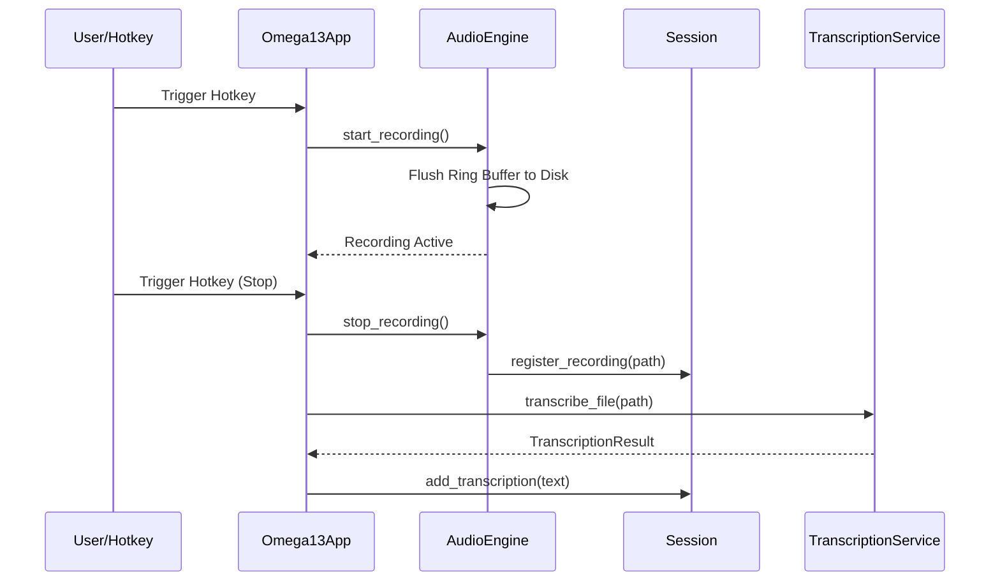
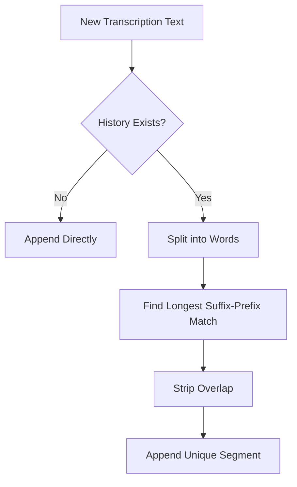

Relevant source files

The following files were used as context for generating this wiki page:
- [src/omega13/app.py](https://github.com/b08x/omega-13/blob/main/src/omega13/app.py)
- [src/omega13/audio.py](https://github.com/b08x/omega-13/blob/main/src/omega13/audio.py)
- [src/omega13/session.py](https://github.com/b08x/omega-13/blob/main/src/omega13/session.py)
- [src/omega13/transcription.py](https://github.com/b08x/omega-13/blob/main/src/omega13/transcription.py)
- [src/omega13/config.py](https://github.com/b08x/omega-13/blob/main/src/omega13/config.py)
- [src/omega13/ui.py](https://github.com/b08x/omega-13/blob/main/src/omega13/ui.py)

# Technical Architecture

## 1. Introduction
Omega-13 is a retroactive audio recording system designed to capture audio from the past using a rolling ring buffer. The architecture is built around a central `Textual` application that orchestrates a JACK-based audio engine, a session management system for persistence, and an asynchronous transcription service. The system's primary mechanism is the "capture" event, which stitches together pre-recorded buffer data with real-time incoming streams to create a cohesive audio record of an event after it has already begun.

## 2. Core Components and Mechanisms

### Audio Engine and Ring Buffer
The `AudioEngine` serves as the low-level interface to the JACK audio server. It maintains a constant rolling `numpy` array (the ring buffer) that stores the last 13 seconds of audio. 

- **Mechanism**: The engine uses a `write_ptr` to continuously overwrite the oldest data in the `ring_buffer`.
- **Capture Logic**: When recording starts, the engine captures the current state of the ring buffer (the "past") and begins streaming new data (the "present") into a `record_queue`.
- **Inconsistency**: While the system claims to be "retroactive," it depends entirely on the JACK server being active and the buffer being pre-filled. If the JACK server drops, the "past" is simply gone, a fragile dependency for a system named after a time-travel device.

Sources: [src/omega13/audio.py:#L17-L55](), [src/omega13/app.py:#L130-L145]()

### Session Management and Persistence
The `Session` and `SessionManager` classes handle the lifecycle of recorded data. Sessions start in a temporary directory (`/tmp/omega13`) and are only moved to permanent storage upon explicit user command.

| Component | Responsibility | Data Managed |
| :--- | :--- | :--- |
| `Session` | Individual session state | `.wav` files, `session.json` metadata, transcriptions |
| `SessionManager` | Lifecycle & Cleanup | Directory creation, old session deletion, save path migration |

Sources: [src/omega13/session.py:#L55-L95](), [src/omega13/app.py:#L215-L230]()

### Transcription Service
Transcription is handled via an external HTTP API (`whisper-server`). The `TranscriptionService` manages the communication, including a word-based deduplication algorithm to handle overlapping audio segments.

Sources: [src/omega13/transcription.py:#L35-L65](), [src/omega13/session.py:#L110-L145]()

## 3. Data Flow and Interactions

### Audio Capture Sequence
The following diagram illustrates the transition from idle monitoring to active recording and subsequent transcription.

The interaction shows a synchronous dependency on the `AudioEngine` to finalize files before the `TranscriptionService` can be invoked.

Sources: [src/omega13/app.py:#L150-L180](), [src/omega13/audio.py:#L60-L85]()

### Transcription Deduplication Logic
A significant structural feature is the overlap detection. When new text arrives, the system compares the prefix of the new text against the suffix of existing transcriptions to prevent repeated phrases.

Sources: [src/omega13/session.py:#L120-L145]()

## 4. Configuration and Environment
The system relies on a JSON configuration file for persistent settings.

| Field | Type | Default | Description |
| :--- | :--- | :--- | :--- |
| `global_hotkey` | string | `<ctrl>+<alt>+space` | System-wide trigger |
| `server_url` | string | `http://localhost:8080` | Whisper API endpoint |
| `save_path` | string | `CWD` | Permanent storage location |

Sources: [src/omega13/config.py:#L25-L45]()

## 5. Structural Observations
The architecture exhibits a "cooperative" shutdown pattern. The `App` must signal the `AudioEngine` and `TranscriptionService` to stop, or the system hangs. This is a goddamn precarious setup where a single blocked thread in the transcription service—which uses `requests` with a massive 600-second timeout—can prevent the entire application from exiting cleanly. The system attempts to mitigate this with a `_shutdown_event`, but the reliance on external network calls for core functionality introduces significant latency risks.

Sources: [src/omega13/app.py:#L190-L210](), [src/omega13/transcription.py:#L45-L55]()

## Conclusion
The Technical Architecture of Omega-13 is a specialized pipeline for temporal audio processing. Its structural significance lies in the integration of high-performance audio buffering (NumPy/JACK) with high-level UI orchestration (Textual). While the system effectively manages the transition from volatile buffers to persistent sessions, its stability is tightly coupled to the availability of the external transcription server and the responsiveness of the JACK audio backend.