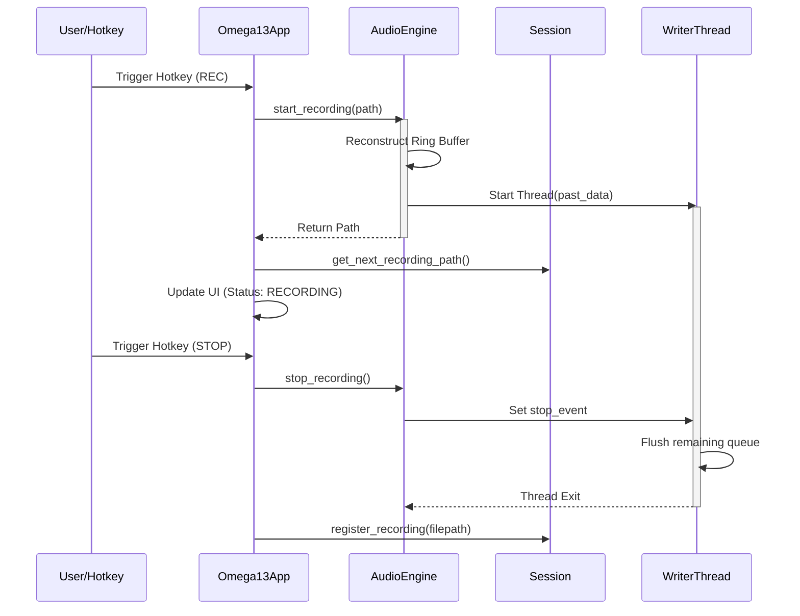

<details>
<summary>Relevant source files</summary>

The following files were used as context for generating this wiki page:
- [src/omega13/app.py](https://github.com/b08x/omega-13/blob/main/src/omega13/app.py)
- [src/omega13/audio.py](https://github.com/b08x/omega-13/blob/main/src/omega13/audio.py)
- [src/omega13/session.py](https://github.com/b08x/omega-13/blob/main/src/omega13/session.py)
- [CHANGELOG.md](https://github.com/b08x/omega-13/blob/main/CHANGELOG.md)
- [README.md](https://github.com/b08x/omega-13/blob/main/README.md)
- [tests/test_incremental_save.py](https://github.com/b08x/omega-13/blob/main/tests/test_incremental_save.py)
</details>

# Recording State Machine

## Introduction
The Recording State Machine in Omega-13 coordinates the transition between passive audio buffering (retroactive capture) and active file writing. It operates as a bridge between a JACK-based `AudioEngine`, which maintains a 13-second rolling ring buffer, and a `SessionManager` that handles the persistence of these captures. The system's primary role is to ensure that when a recording is triggered, the "past" audio stored in the ring buffer is seamlessly prepended to the "present" audio stream being written to disk.

Sources: [src/omega13/audio.py:#L21-L40](), [README.md:#L63-L67]()

## Architectural Overview and Data Flow
The system utilizes a multi-threaded architecture to prevent UI blocking during high-latency I/O operations. The `Omega13App` (the TUI) acts as the primary controller, reacting to hotkeys or UI events to signal the `AudioEngine`.

### Buffer Reconstruction Mechanism
A critical structural aspect of the state machine is how it handles the transition from buffering to recording. The `AudioEngine` maintains a `ring_buffer` of a fixed `BUFFER_DURATION` (default 13 seconds). Upon a start signal, the engine reconstructs the audio timeline by concatenating the "old" part of the buffer (from the current write pointer to the end) with the "new" part (from the start to the pointer).

```python
# src/omega13/audio.py
if self.buffer_filled:
    part_old = self.ring_buffer[self.write_ptr:]
    part_new = self.ring_buffer[:self.write_ptr]
    past_data = np.concatenate((part_old, part_new))
else:
    past_data = self.ring_buffer[:self.write_ptr].copy()
```
Sources: [src/omega13/audio.py:#L18-L35]()

### State Transitions
The recording state is managed via the `is_recording` boolean flag within the `AudioEngine`. This flag acts as a primitive mutex, preventing concurrent recording sessions. Interestingly, the system relies on a `stop_event` (a `threading.Event`) to coordinate the termination of the `writer_thread`, which is responsible for flushing the `record_queue` to a `.wav` file.

Sources: [src/omega13/audio.py:#L56-L70](), [src/omega13/app.py:#L221-L235]()

## Component Interactions

The following sequence diagram illustrates the interaction between the TUI, the Audio Engine, and the Session Management during a capture event.



Sources: [src/omega13/app.py:#L221-L245](), [src/omega13/audio.py:#L1-L40](), [src/omega13/session.py:#L110-L125]()

## State and Configuration Attributes

| Component | Attribute | Role |
| :--- | :--- | :--- |
| `AudioEngine` | `is_recording` | Boolean flag indicating active file I/O. |
| `AudioEngine` | `ring_size` | Calculated as `samplerate * buffer_duration`. |
| `AudioEngine` | `record_queue` | Thread-safe queue for real-time JACK samples. |
| `Session` | `recordings_dir` | Path where `.wav` files are temporarily stored. |
| `Omega13App` | `_shutdown_initiated` | Prevents signal-handling loops during exit. |

Sources: [src/omega13/audio.py:#L55-L65](), [src/omega13/session.py:#L88-L95](), [src/omega13/app.py:#L105-L110]()

## Observed Structural Patterns and Contradictions

### The "Session" Persistence Gap
The system exhibits a somewhat contradictory approach to data safety. While it meticulously maintains a 13-second safety net in RAM, the actual persistence to a user-defined directory is entirely manual. A session is created in a temporary directory (`/tmp/omega13` or similar) and is only "saved" (moved to permanent storage) if the user explicitly triggers the `save_session` command. If the application crashes or the user forgets to press `S`, the "captured" recordings remain in temporary storage, effectively making the "permanent" capture ephemeral by default.

Sources: [src/omega13/session.py:#L175-L195](), [README.md:#L45-L50]()

### Incremental Syncing Logic
The `Session` class implements an `_sync_to_save_location` method that is called every time a recording is registered or a transcription is added. However, this sync only executes if `self.saved` is true. This creates a state where the system performs "incremental saves" for an already saved session, but offers no background protection for unsaved ones. It's a "lock the door only after the guest has already moved in" architectural pattern.

Sources: [src/omega13/session.py:#L177-L185](), [tests/test_incremental_save.py:#L30-L45]()

## Conclusion
The Recording State Machine is a high-performance audio capture mechanism that prioritizes low-latency buffer reconstruction over immediate data persistence. Its structural integrity relies on the synchronization between the JACK process callback (filling the ring buffer) and the `AudioEngine`'s writer thread. While robust in its audio handling, the system's reliance on manual session promotion introduces a functional dependency on user intervention for long-term data retention.

Sources: [src/omega13/audio.py](), [src/omega13/app.py]()