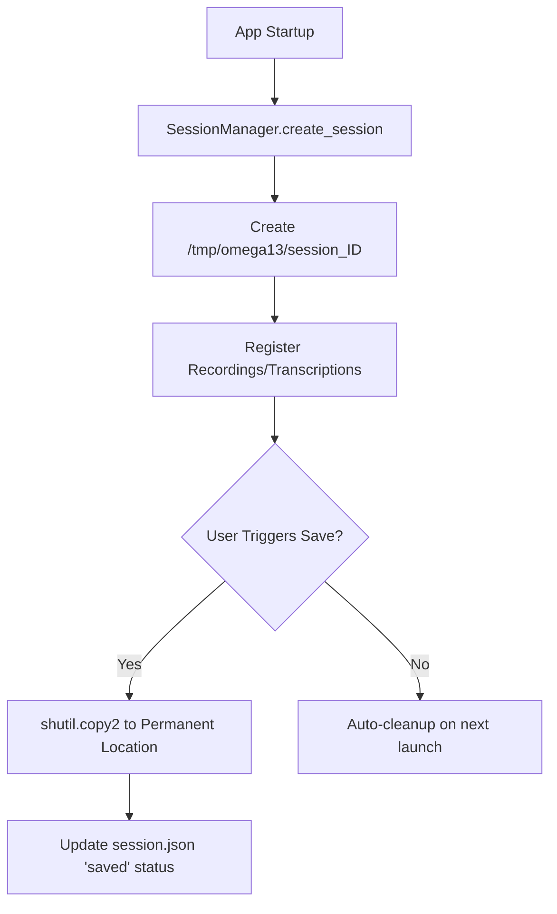
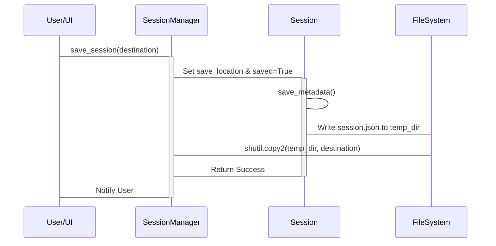

<details>
<summary>Relevant source files</summary>

The following files were used as context for generating this wiki page:
- [src/omega13/session.py](https://github.com/b08x/omega-13/blob/main/src/omega13/session.py)
- [tests/test_deduplication.py](https://github.com/b08x/omega-13/blob/main/tests/test_deduplication.py)
- [tests/test_incremental_save.py](https://github.com/b08x/omega-13/blob/main/tests/test_incremental_save.py)
- [src/omega13/app.py](https://github.com/b08x/omega-13/blob/main/src/omega13/app.py)
- [CHANGELOG.md](https://github.com/b08x/omega-13/blob/main/CHANGELOG.md)
</details>

# Session & Data Management

## Introduction
Session & Data Management in Omega-13 coordinates the lifecycle of audio recordings and their associated metadata. It acts as a bridge between volatile temporary storage (typically `/tmp/omega13`) and permanent user-defined directories. The system relies on a sequential registration of audio files and a word-based deduplication mechanism for transcriptions, ensuring that incremental updates do not result in redundant data.

Sources: `[src/omega13/session.py:#L1-L15]`, `[src/omega13/app.py:#L1-L20]`

## Architecture and Data Flow
The architecture is centered around the `SessionManager`, which orchestrates the `Session` objects. Each session maintains its own directory structure for raw audio and transcription text.

### Component Responsibilities
| Component | Responsibility | Key Methods |
| :--- | :--- | :--- |
| `SessionManager` | Manages session creation, persistence, and cleanup of old temporary files. | `create_session`, `save_session` |
| `Session` | Handles the internal directory structure, metadata serialization, and transcription deduplication. | `register_recording`, `add_transcription`, `save_metadata` |
| `SessionRecording` | Data class representing a single WAV file's metadata. | `to_dict`, `from_dict` |

Sources: `[src/omega13/session.py:#L25-L150]`

### Session Lifecycle Flow
The following diagram illustrates the transition from a volatile temporary session to a persisted state.



Sources: `[src/omega13/session.py:#L100-L130]`, `[src/omega13/app.py:#L15-L25]`

## Transcription Deduplication Mechanism
A critical, albeit somewhat finicky, feature is the word-based suffix-prefix matching used when adding transcriptions. Because the transcription service may return overlapping segments of audio, the `Session` class attempts to find the longest overlapping word sequence between the new text and the last five historical entries.

If the system finds that the start of the new text matches the end of the existing history, it strips the overlap. This prevents the "goddamn double-talk" effect in the final logs.

```python
# src/omega13/session.py
history_context = " ".join(self.transcriptions[-5:]).split()
new_words = new_text.split()

max_overlap = 0
max_search = min(len(history_context), len(new_words))

for i in range(1, max_search + 1):
    if history_context[-i:] == new_words[:i]:
        max_overlap = i
```

Sources: `[src/omega13/session.py:#L160-L185]`, `[tests/test_deduplication.py]`

## Data Persistence and Synchronization
The system implements an incremental sync pattern. Once a session is marked as `saved`, any subsequent recordings or transcriptions are automatically mirrored to the permanent storage location via `_sync_to_save_location`.

### Metadata Structure (`session.json`)
| Field | Type | Description |
| :--- | :--- | :--- |
| `session_id` | String | Unique ID: `session_YYYYMMDD_HHMMSS_UUID` |
| `recordings` | List[Dict] | List of serialized `SessionRecording` objects |
| `transcriptions` | List[String] | Deduplicated transcription segments |
| `saved` | Boolean | Persistence status |

Sources: `[src/omega13/session.py:#L190-L210]`, `[tests/test_incremental_save.py]`

### The Persistence Sequence
The interaction between the manager and the active session during a save operation:



Sources: `[src/omega13/session.py:#L110-L145]`, `[src/omega13/app.py:#L30-L45]`

## Structural Observations
The system exhibits a tight coupling between the `Session` and the filesystem. A `Session` object cannot exist without creating physical directories (`recordings/` and `transcriptions/`) immediately upon instantiation. While this ensures data integrity, it means the mere act of "thinking" about a session litters the `/tmp` directory. Furthermore, the deduplication logic relies on a hardcoded "last 5 entries" context, which is a structural heuristic that might fail if transcription segments are exceptionally long or short.

Sources: `[src/omega13/session.py:#L70-L85]`, `[src/omega13/session.py:#L175]`

## Conclusion
Session & Data Management in Omega-13 provides a robust, if opinionated, pipeline for retroactive audio storage. By utilizing a dual-stage storage strategy and word-based deduplication, it maintains a clean record of events despite the potentially chaotic nature of streaming audio transcriptions. Its structural significance lies in its ability to transform transient audio buffers into a structured, searchable historical archive.

Sources: `[src/omega13/session.py]`, `[CHANGELOG.md]`