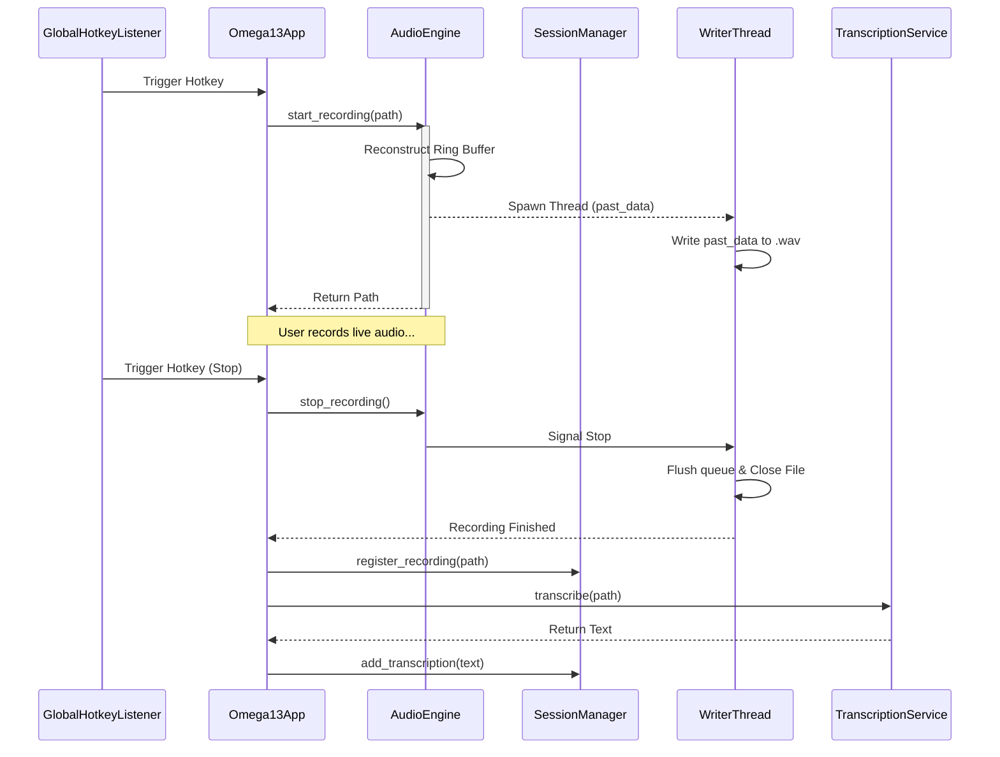

Relevant source files

The following files were used as context for generating this wiki page:
- [src/omega13/audio.py](https://github.com/b08x/omega-13/blob/main/src/omega13/audio.py)
- [src/omega13/app.py](https://github.com/b08x/omega-13/blob/main/src/omega13/app.py)
- [src/omega13/session.py](https://github.com/b08x/omega-13/blob/main/src/omega13/session.py)
- [src/omega13/ui.py](https://github.com/b08x/omega-13/blob/main/src/omega13/ui.py)
- [README.md](https://github.com/b08x/omega-13/blob/main/README.md)
- [CHANGELOG.md](https://github.com/b08x/omega-13/blob/main/CHANGELOG.md)

# Retroactive Recording Mechanism

### 1. Introduction

The Retroactive Recording Mechanism in Omega-13 is a continuous audio buffering system designed to capture audio data that occurred *prior* to a user's explicit trigger. By maintaining a rolling 13-second ring buffer in memory, the system allows for "time-rewind" capabilities where a capture event persists both the historical buffer and the live incoming stream to a physical file.

Sources: [README.md](https://github.com/b08x/omega-13/blob/main/README.md), [src/omega13/audio.py:#L14-L15](https://github.com/b08x/omega-13/blob/main/src/omega13/audio.py#L14-L15)

### 2. Core Architecture and Data Flow

#### 2.1 The Rolling Ring Buffer

The system's heart is a NumPy-based ring buffer initialized within the `AudioEngine`. This buffer is statically sized based on the sample rate and a fixed 13-second duration.

- **Initialization**: The buffer is a `float32` array with dimensions `(samplerate * 13, channels)`.
- **Continuous Write**: A `write_ptr` tracks the current position. When the pointer reaches the end of the array, it wraps back to zero, overwriting the oldest data.
- **State Tracking**: A `buffer_filled` flag is set once the pointer has completed its first full pass, indicating that a full 13 seconds of history is available.

Sources: [src/omega13/audio.py:#L36-L42](https://github.com/b08x/omega-13/blob/main/src/omega13/audio.py#L36-L42)

#### 2.2 Trigger and Reconstruction

When a recording is triggered (via global hotkey or UI), the `AudioEngine` performs a "buffer reconstruction." This process is fucking critical because it transforms a circular memory structure into a linear temporal sequence for the file writer.

| Step | Action | Logic |
| :--- | :--- | :--- |
| 1 | **Identify Past Data** | If `buffer_filled` is true, it concatenates the segment from `write_ptr` to end with the segment from start to `write_ptr`. |
| 2 | **Initialize Writer** | A background `writer_thread` is spawned to handle I/O without blocking the audio callback. |
| 3 | **Live Append** | Incoming audio during the active recording phase is pushed to a `record_queue` for the writer thread to consume. |

Sources: [src/omega13/audio.py:#L73-L98](https://github.com/b08x/omega-13/blob/main/src/omega13/audio.py#L73-L98)

### 3. System Interactions

The following sequence diagram illustrates the flow from a hotkey trigger through the audio reconstruction and eventual transcription.

Sources: [src/omega13/app.py:#L12-L40](https://github.com/b08x/omega-13/blob/main/src/omega13/app.py#L12-L40), [src/omega13/audio.py:#L73-L110](https://github.com/b08x/omega-13/blob/main/src/omega13/audio.py#L73-L110), [src/omega13/session.py:#L145-L160](https://github.com/b08x/omega-13/blob/main/src/omega13/session.py#L145-L160)

### 4. Component Responsibilities

The system relies on a tight coupling between the JACK audio server and the Python-based management logic.

| Component | Responsibility | Key Interaction |
| :--- | :--- | :--- |
| `AudioEngine` | Buffer management and JACK I/O. | Uses `numpy` for high-speed buffer rotation. |
| `Session` | File path generation and metadata. | Generates sequential filenames like `001.wav`. |
| `WriterThread` | Non-blocking Disk I/O. | Consumes `record_queue` to prevent audio dropouts. |
| `Omega13App` | State coordination. | Orchestrates the transition from recording to transcription. |

Sources: [src/omega13/audio.py:#L17-L55](https://github.com/b08x/omega-13/blob/main/src/omega13/audio.py#L17-L55), [src/omega13/session.py:#L120-L140](https://github.com/b08x/omega-13/blob/main/src/omega13/session.py#L120-L140), [src/omega13/app.py](https://github.com/b08x/omega-13/blob/main/src/omega13/app.py)

### 5. Observed Structural Tendencies

An interesting, albeit somewhat rigid, pattern is the hardcoding of the `BUFFER_DURATION` to 13 seconds in `audio.py`. While the `AudioEngine` accepts a `buffer_duration` argument, the constant `BUFFER_DURATION = 13` is the system default, deeply tying the application's identity (Omega-13) to its technical implementation.

Furthermore, the "Capture Blocked" logic mentioned in the README implies a dependency on signal detection. If the input signal is silent, the system may refuse to persist the buffer, an implicit constraint that ensures the "time machine" doesn't waste resources on silence.

Sources: [src/omega13/audio.py:#L14](https://github.com/b08x/omega-13/blob/main/src/omega13/audio.py#L14), [README.md: "Troubleshooting"]()

### 6. Conclusion

The Retroactive Recording Mechanism is a specialized implementation of a circular buffer that leverages NumPy for performance and JACK for low-latency audio access. Its structural significance lies in the seamless transition between asynchronous memory buffering and synchronous file persistence, mediated by a dedicated writer thread to ensure system stability during I/O-heavy operations.

Sources: [src/omega13/audio.py](https://github.com/b08x/omega-13/blob/main/src/omega13/audio.py), [src/omega13/session.py](https://github.com/b08x/omega-13/blob/main/src/omega13/session.py)