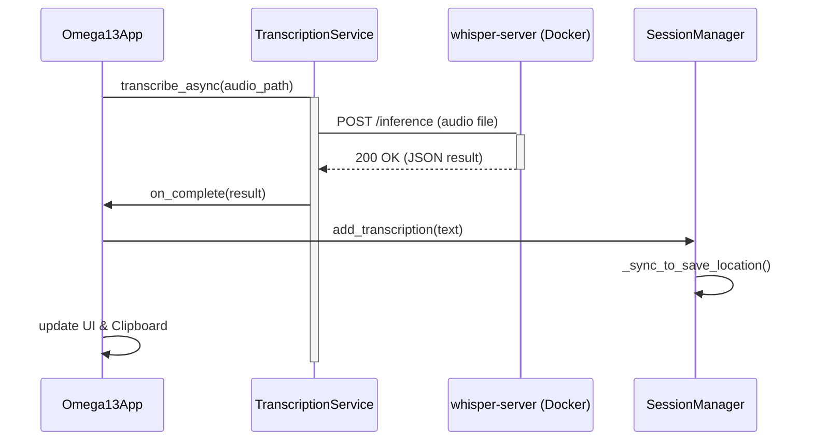

<details>
<summary>Relevant source files</summary>

The following files were used as context for generating this wiki page:
- [src/omega13/transcription.py](https://github.com/b08x/omega-13/blob/main/src/omega13/transcription.py)
- [src/omega13/app.py](https://github.com/b08x/omega-13/blob/main/src/omega13/app.py)
- [src/omega13/session.py](https://github.com/b08x/omega-13/blob/main/src/omega13/session.py)
- [src/omega13/ui.py](https://github.com/b08x/omega-13/blob/main/src/omega13/ui.py)
- [src/omega13/config.py](https://github.com/b08x/omega-13/blob/main/src/omega13/config.py)
- [README.md](https://github.com/b08x/omega-13/blob/main/README.md)
</details>

# Transcription Pipeline

## Introduction
The Transcription Pipeline in Omega-13 is a decoupled, asynchronous mechanism designed to convert captured audio buffers into text via an external HTTP API. It acts as the bridge between the `AudioEngine`'s output and the user's clipboard or session storage. The pipeline is characterized by its reliance on a local Docker-based `whisper-server` and a reactive UI that tracks processing states.

Sources: [src/omega13/transcription.py](), [README.md]()

## Architectural Flow
The pipeline operates by sending `.wav` files to a Whisper inference endpoint. The `TranscriptionService` manages the lifecycle of these requests, including error handling and progress reporting.

### Data Flow Mechanism
1. **Trigger**: A recording is finalized in `Omega13App`.
2. **Dispatch**: The app calls `transcribe_async`, spawning a non-daemon thread.
3. **Transmission**: The audio file is POSTed to the configured `server_url`.
4. **Deduplication**: Upon receipt of text, the `Session` manager performs word-based suffix-prefix matching to prevent redundant text segments in the session history.
5. **Output**: Text is simultaneously routed to the `TranscriptionDisplay` UI, the system clipboard (if enabled), and the session's metadata.

Sources: [src/omega13/transcription.py:#L66-L85](), [src/omega13/session.py:#L25-L60]()

### Sequence of Operations
The following diagram illustrates the interaction between the UI, the service, and the external inference server.


Sources: [src/omega13/transcription.py](), [src/omega13/app.py:#L175-L200]()

## Component Specifications

### TranscriptionService Configuration
The service is highly dependent on the `ConfigManager` for its network identity and operational constraints.

| Parameter | Default Value | Description |
| :--- | :--- | :--- |
| `server_url` | `http://localhost:8080` | The base URL for the whisper-server. |
| `inference_path` | `/inference` | The specific endpoint for transcription. |
| `timeout` | 600 seconds | Maximum time allowed for a single request. |
| `copy_to_clipboard` | `True` (Config) | Global toggle for automated clipboard injection. |

Sources: [src/omega13/config.py:#L30-L40](), [src/omega13/transcription.py:#L38-L50]()

### State Management
The pipeline uses an `Enum` to track the lifecycle of a transcription task, which is reflected in the UI's `TranscriptionDisplay`.

```python
class TranscriptionStatus(Enum):
    IDLE = "idle"
    LOADING_MODEL = "loading_model"
    PROCESSING = "processing"
    COMPLETED = "completed"
    ERROR = "error"
```
Sources: [src/omega13/transcription.py:#L21-L26]()

## Observed Structural Inconsistencies
The system exhibits a few "interesting" architectural choices. For instance, the `TranscriptionService` is instantiated with a `daemon=False` thread in `transcribe_async`, yet the `Omega13App` attempts a "graceful shutdown" that must cooperatively signal these threads to stop. If the `whisper-server` hangs, the app's shutdown logic might be fucked if the timeout isn't strictly enforced during the join.

Furthermore, the deduplication logic in `session.py` relies on a word-based suffix match of the last 5 transcriptions. This assumes that subsequent recordings will always overlap in a linear, predictable fashion, which is a fragile goddamn way to handle continuous audio streams if the user triggers captures rapidly.

Sources: [src/omega13/transcription.py:#L81](), [src/omega13/session.py:#L45-L55](), [src/omega13/app.py:#L135-L150]()

## Session Integration and Deduplication
The `Session` class ensures that transcriptions are not just appended but merged intelligently.

```python
# Suffix-prefix overlap detection
history_context = " ".join(self.transcriptions[-5:]).split()
new_words = new_text.split()
max_overlap = 0
for i in range(1, min(len(history_context), len(new_words)) + 1):
    if history_context[-i:] == new_words[:i]:
        max_overlap = i
unique_segment = " ".join(new_words[max_overlap:])
```
Sources: [src/omega13/session.py:#L48-L58]()

## Conclusion
The Transcription Pipeline is a reactive, network-dependent subsystem. Its structural significance lies in its ability to offload heavy compute (Whisper inference) to a separate containerized environment while maintaining a tight feedback loop with the Textual UI. While the deduplication and thread management logic introduce potential points of failure, the pipeline successfully abstracts the complexity of audio-to-text conversion from the core `AudioEngine`.