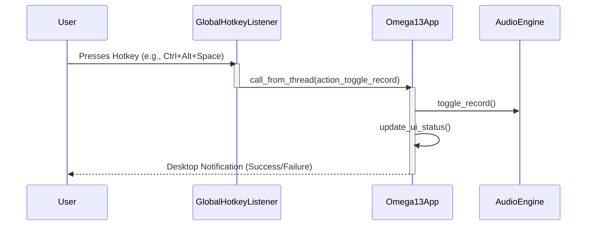

<details>
<summary>Relevant source files</summary>

The following files were used as context for generating this wiki page:
- [src/omega13/hotkeys.py](https://github.com/b08x/omega-13/blob/main/src/omega13/hotkeys.py)
- [src/omega13/notifications.py](https://github.com/b08x/omega-13/blob/main/src/omega13/notifications.py)
- [src/omega13/app.py](https://github.com/b08x/omega-13/blob/main/src/omega13/app.py)
- [src/omega13/config.py](https://github.com/b08x/omega-13/blob/main/src/omega13/config.py)
- [README.md](https://github.com/b08x/omega-13/blob/main/README.md)
</details>

# Global Hotkey & Notifications

## Introduction
The "Global Hotkey & Notifications" system provides the primary interface for asynchronous interaction with the Omega-13 recording engine. It bridges the gap between the terminal-based UI and the system environment, allowing users to trigger recording state changes while the application is unfocused. This mechanism relies on a combination of local event listening and system-level signal handling to overcome environmental constraints like Wayland's security model.

Sources: [src/omega13/app.py:#L120-L135](), [README.md:#L85-L105]()

## Global Hotkey Architecture
The hotkey system is designed around the `GlobalHotkeyListener` class, which utilizes the `pynput` library to monitor keyboard events. A significant structural constraint is observed in the implementation: while the application attempts to listen for global keys, it explicitly acknowledges that Wayland prevents applications from "spying" on global keystrokes. This creates a functional contradiction where the internal listener may fail, necessitating an external "poke" via a CLI toggle command.

### Key Resolution and Normalization
The system performs normalization on hotkey strings to ensure compatibility between configuration formats and `pynput` requirements.

| Component | Responsibility |
| :--- | :--- |
| `_resolve_hotkey` | Strips brackets and maps aliases like "enter" or "space" to `<enter>` and `<space>`. |
| `ConfigManager` | Provides the default hotkey string: `<ctrl>+<alt>+space`. |
| `pynput` | Optional dependency; if missing, global hotkeys are disabled. |

Sources: [src/omega13/hotkeys.py:#L15-L55](), [src/omega13/config.py:#L30-L35]()

### Interaction Logic
The following diagram illustrates the flow from a hotkey trigger to the recording state change.


Note: The use of `call_from_thread` is a critical structural requirement because the hotkey listener runs in a separate thread from the Textual UI loop.

Sources: [src/omega13/app.py:#L125-L135](), [src/omega13/hotkeys.py:#L65-L75]()

## Notification Mechanism
Desktop notifications are handled by the `DesktopNotifier` class. This component is a thin wrapper around the system's `notify-send` utility. It is functionally dependent on the existence of this binary in the user's PATH; if `shutil.which("notify-send")` returns None, the system silently fails to notify, which is a shitty but common pattern for Linux desktop integration.

### Notification Attributes
Sources: [src/omega13/notifications.py:#L10-L35]()

| Parameter | Type | Default | Description |
| :--- | :--- | :--- | :--- |
| `title` | String | N/A | The summary of the event. |
| `message` | String | N/A | The body text. |
| `urgency` | String | "normal" | Maps to `notify-send -u`. |
| `timeout` | Integer | 2000 | Expiration in milliseconds. |

## Structural Inconsistencies: The Wayland Problem
The architecture reveals a desperate workaround for modern Linux display servers. Because the internal `GlobalHotkeyListener` is often neutered by Wayland's security protocols, the application implements a secondary signaling path using `SIGUSR1`.

1.  **Internal Path:** `pynput` -> `action_toggle_record`.
2.  **External Path:** `omega13 --toggle` -> Reads PID file -> Sends `SIGUSR1` to process -> `action_toggle_record`.

This redundancy highlights a system that cannot trust its own primary input mechanism. The PID file management in `app.py` exists solely to facilitate this external "poke" because the global hotkey implementation is structurally unreliable in non-X11 environments.

Sources: [src/omega13/app.py:#L105-L115](), [src/omega13/app.py:#L190-L210](), [README.md:#L90-L100]()

```python
# src/omega13/app.py - External Toggle Support
if hasattr(signal, "SIGUSR1"):
    signal.signal(signal.SIGUSR1, lambda s, f: self.call_later(self.action_toggle_record))
```

## Configuration and Initialization
The `ConfigManager` determines if notifications are even attempted via `get_desktop_notifications_enabled()`. During the `on_mount` phase of the application, the hotkey listener is initialized only after the UI components are ready, ensuring that the callback has a valid application state to manipulate.

Sources: [src/omega13/config.py:#L75-L80](), [src/omega13/app.py:#L120-L130]()

## Conclusion
The Global Hotkey & Notifications system is the primary sensory and feedback loop for the user. Its structural significance lies in its dual-path execution—maintaining an internal listener for legacy environments while providing a signal-based API for modern, restricted environments. This complexity is the direct result of the application's need to operate as a background service while maintaining a TUI-based frontend.