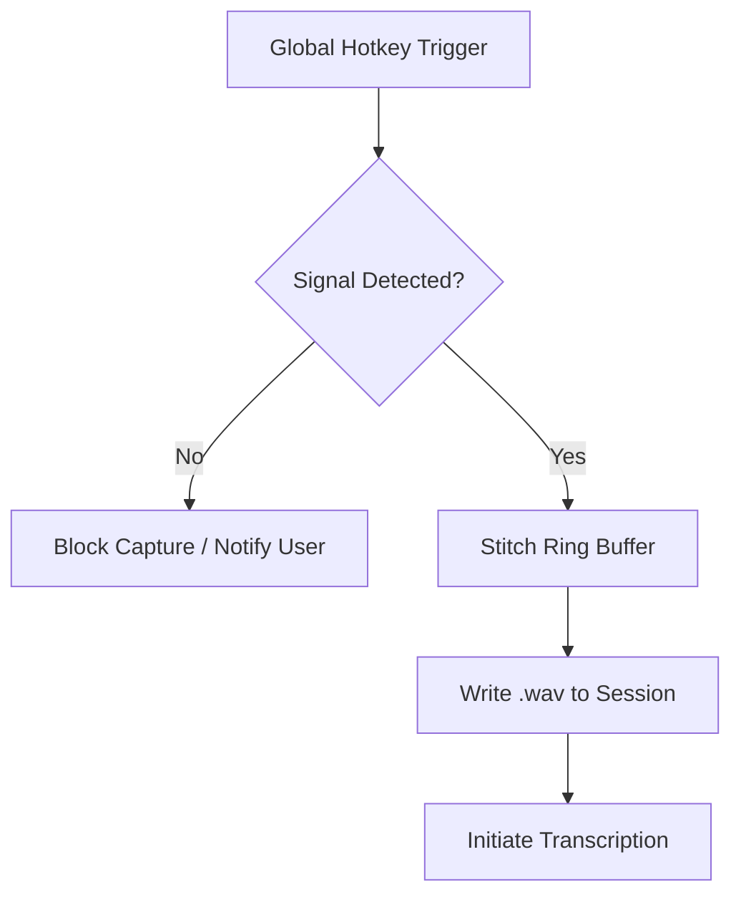

<details>
<summary>Relevant source files</summary>

The following files were used as context for generating this wiki page:
- [src/omega13/app.py](https://github.com/b08x/omega-13/blob/main/src/omega13/app.py)
- [src/omega13/audio.py](https://github.com/b08x/omega-13/blob/main/src/omega13/audio.py)
- [src/omega13/session.py](https://github.com/b08x/omega-13/blob/main/src/omega13/session.py)
- [src/omega13/transcription.py](https://github.com/b08x/omega-13/blob/main/src/omega13/transcription.py)
- [src/omega13/ui.py](https://github.com/b08x/omega-13/blob/main/src/omega13/ui.py)
- [CHANGELOG.md](https://github.com/b08x/omega-13/blob/main/CHANGELOG.md)
</details>

# Voice-Activated Auto-Record (VAD)

## 1. Introduction
Voice-Activated Auto-Record (VAD), referred to in the codebase as "pre-recording audio activity detection," is a mechanism designed to gate the recording process based on the presence of audio signals. Its primary role is to prevent the system from capturing and processing silent or empty audio buffers, which would otherwise waste computational resources during the transcription phase. The system operates by monitoring input levels and blocking capture triggers if the signal does not meet specific activity thresholds.

Sources: [CHANGELOG.md](), [README.md]()

## 2. Audio Monitoring and Signal Detection
The VAD mechanism is integrated into the `AudioEngine` and the UI's `VUMeter` components. The system calculates decibel (dB) levels and peak amplitudes from the JACK input ports to determine if a "thought" is actually being spoken.

### 2.1 Metering and Thresholds
The `AudioEngine` maintains real-time peak and dB calculations for each input channel. These values are used by the UI to provide visual feedback and by the recording logic to validate if a capture should proceed.

| Component | Responsibility | Data Points |
| :--- | :--- | :--- |
| `AudioEngine` | Real-time signal processing | `self.peaks`, `self.dbs` |
| `VUMeter` | Visual representation of signal | `level`, `db_level` |
| `TranscriptionService` | Post-capture validation | Audio path existence/validity |

Sources: [src/omega13/audio.py:#L46-L47](), [src/omega13/ui.py:#L14-L32]()

### 2.2 Structural Flow of Signal Validation
The system utilizes a rolling NumPy ring buffer to store the last 13 seconds of audio. When a capture is triggered (via global hotkey or CLI), the system checks the buffer state. If no signal is detected—a state described in the documentation as "Capture Blocked - No Input Signal"—the recording process is aborted.


Note: The "Capture Blocked" state is an explicit safety check to ensure the local AI model (Whisper) is not invoked on silence.

Sources: [src/omega13/audio.py:#L66-L95](), [README.md]()

## 3. Implementation Details

### 3.1 Buffer Management
The `AudioEngine` handles the 13-second "retroactive" window. The VAD logic implicitly relies on the `buffer_filled` flag and the `write_ptr` to determine if there is sufficient data to even evaluate for activity.

```python
# src/omega13/audio.py:#L79-L85
if self.buffer_filled:
    part_old = self.ring_buffer[self.write_ptr:]
    part_new = self.ring_buffer[:self.write_ptr]
    past_data = np.concatenate((part_old, part_new))
else:
    past_data = self.ring_buffer[:self.write_ptr].copy()
```

Sources: [src/omega13/audio.py:#L79-L85]()

### 3.2 Integration with UI
The `Omega13App` coordinates the VAD feedback loop. If the `AudioEngine` reports peaks below the threshold, the `status-bar` in the TUI remains `IDLE` or displays a warning, preventing the transition to the `RECORDING` state (marked by a red UI change).

Sources: [src/omega13/app.py:#L45-L55](), [src/omega13/app.py:#L174-L185]()

## 4. Observed Structural Inconsistencies
The system presents a curious contradiction in its "always listening" philosophy. While it maintains a constant 13-second buffer, the actual VAD logic appears to be a "gatekeeper" at the moment of trigger rather than a continuous start/stop mechanism. This means the system is fucking listening all the time, but it only decides if that listening was "worth it" once you've already hit the button. 

Furthermore, the `TranscriptionService` is strictly dependent on the output of this gated recording. If the VAD logic fails to block a silent recording, the system will proceed to send an empty `.wav` file to the `whisper-server`, leading to unnecessary HTTP overhead and potential "processing" of background noise.

Sources: [src/omega13/transcription.py:#L57-L70](), [README.md]()

## 5. Conclusion
The Voice-Activated Auto-Record (VAD) mechanism in Omega-13 serves as a critical filter between the continuous audio capture of the JACK client and the resource-heavy AI transcription backend. By leveraging real-time peak detection and decibel monitoring, it ensures that only meaningful audio segments are promoted from the temporary ring buffer to permanent session storage. Its structural significance lies in its role as a resource-saver for local GPU/CPU inference.