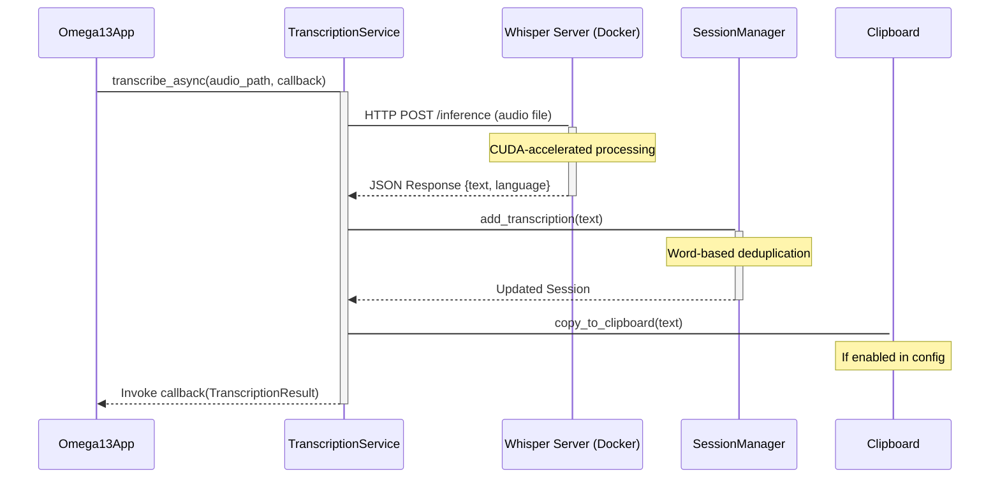

<details>
<summary>Relevant source files</summary>

The following files were used as context for generating this wiki page:
- [src/omega13/transcription.py](https://github.com/b08x/omega-13/blob/main/src/omega13/transcription.py)
- [src/omega13/app.py](https://github.com/b08x/omega-13/blob/main/src/omega13/app.py)
- [src/omega13/session.py](https://github.com/b08x/omega-13/blob/main/src/omega13/session.py)
- [src/omega13/config.py](https://github.com/b08x/omega-13/blob/main/src/omega13/config.py)
- [README.md](https://github.com/b08x/omega-13/blob/main/README.md)
- [src/omega13/ui.py](https://github.com/b08x/omega-13/blob/main/src/omega13/ui.py)
</details>

# Transcription & Whisper Integration

The transcription system in Omega-13 functions as a decoupled, asynchronous pipeline that bridges local audio capture with an externalized AI inference engine. It relies on a containerized `whisper-server` communicating via an HTTP API to transform `.wav` recordings into text, which is then processed for deduplication and session persistence.

## 1. System Architecture and Data Flow

The integration is built around the `TranscriptionService` class, which manages the lifecycle of transcription requests. The flow begins when the `Omega13App` triggers a recording stop, resulting in a saved audio file that is then dispatched to the service.

### Transcription Pipeline Flow
The following diagram illustrates the sequence from audio finalization to text delivery.


Sources: `[src/omega13/transcription.py:#L83-L110]`, `[src/omega13/app.py:#L145-L160]`, `[README.md]`

## 2. Core Components and Mechanisms

### TranscriptionService
This class encapsulates the HTTP logic and threading required to interact with the Whisper backend. It uses a `threading.Thread` with `daemon=False` to ensure that transcription tasks are not abruptly killed during application exit, though it implements a `_shutdown_event` for cooperative termination.

**Key Attributes:**
| Attribute | Description | Source |
| :--- | :--- | :--- |
| `server_url` | Base URL for the whisper-server (default: `http://localhost:8080`) | `[src/omega13/transcription.py:#L36]` |
| `endpoint` | Concatenation of URL and `/inference` path | `[src/omega13/transcription.py:#L43]` |
| `timeout` | 600-second limit for inference requests | `[src/omega13/transcription.py:#L38]` |

### Data Structures
The system utilizes a `TranscriptionResult` dataclass to pass structured information back to the UI.
```python
@dataclass
class TranscriptionResult:
    text: str
    status: TranscriptionStatus
    error: Optional[str] = None
    segments: Optional[list[dict]] = None
    language: Optional[str] = None
    duration: Optional[float] = None
```
Sources: `[src/omega13/transcription.py:#L24-L31]`

## 3. Session Integration and Deduplication

A critical, albeit slightly annoying, architectural detail is how the system handles overlapping audio. Since Omega-13 captures "13 seconds before" the trigger, consecutive recordings often contain redundant speech. The `Session` class in `session.py` attempts to fix this shit by performing word-based suffix-prefix matching.

### Deduplication Logic
The `add_transcription` method compares the new text against the last five entries in the session history. It identifies the longest overlapping word sequence and strips it from the new segment before saving.

```python
history_context = " ".join(self.transcriptions[-5:]).split()
new_words = new_text.split()

# Find the longest suffix of history that matches the prefix of new_words
max_overlap = 0
for i in range(1, min(len(history_context), len(new_words)) + 1):
    if history_context[-i:] == new_words[:i]:
        max_overlap = i

unique_segment = " ".join(new_words[max_overlap:])
```
Sources: `[src/omega13/session.py:#L22-L55]`

## 4. Configuration and Environment

The transcription behavior is governed by the `ConfigManager`. While the system defaults to a local server, it is hardcoded to expect specific response keys like `text`.

| Config Field | Default Value | Description |
| :--- | :--- | :--- |
| `enabled` | `True` | Global toggle for transcription |
| `server_url` | `http://localhost:8080` | Endpoint for the Docker container |
| `model_size` | `large-v3-turbo` | The specific Whisper model requested |
| `copy_to_clipboard` | `False` (UI Toggle) | Automatic sync to system clipboard |

Sources: `[src/omega13/config.py:#L32-L40]`, `[src/omega13/app.py:#L100]`

## 5. Structural Observations and Contradictions

The architecture presents a few interesting operational tendencies:
- **Dependency Paradox:** The application is designed as a TUI, yet it is functionally useless for its primary purpose without a heavy Docker-based CUDA backend. If the `whisper-server` is down, the `TranscriptionService` returns an `ERROR` status, but the audio is still saved to the session, creating a "silent" session metadata file.
- **Thread Management:** The switch from `daemon=True` to `daemon=False` in `transcribe_async` indicates a move toward "cooperative shutdown." However, the code still uses a `_shutdown_event` that requires the worker thread to check it manually, which could still lead to hangs if the `requests.post` call is blocked mid-inference.
- **Deduplication Sensitivity:** The deduplication relies entirely on exact word matches. Any slight variation in Whisper's output for the same audio (due to hallucinations or temperature) will cause the deduplication to fail, resulting in stuttered text in the final session file.

Sources: `[src/omega13/transcription.py:#L107]`, `[src/omega13/session.py:#L45]`, `[CHANGELOG.md]`

## Conclusion

The Transcription & Whisper Integration is the primary data-consumer of the Omega-13 system. It transforms transient audio buffers into persistent, deduplicated text through an asynchronous HTTP-based bridge to a containerized inference engine. Its structural significance lies in its role as the final stage of the "retroactive" pipeline, ensuring that captured thoughts are not just recorded, but immediately actionable via the clipboard and session storage.