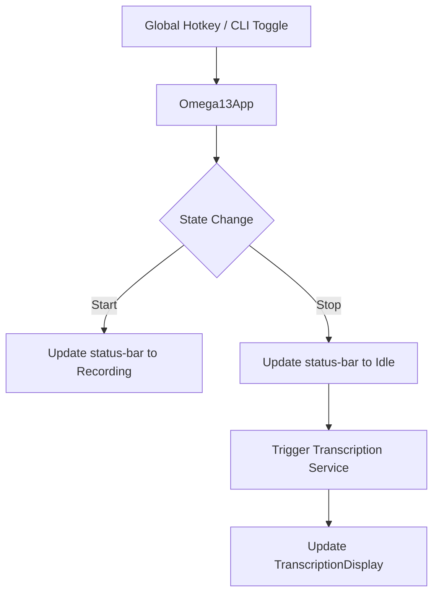

<details>
<summary>Relevant source files</summary>

The following files were used as context for generating this wiki page:
- [src/omega13/app.py](https://github.com/b08x/omega-13/blob/main/src/omega13/app.py)
- [src/omega13/ui.py](https://github.com/b08x/omega-13/blob/main/src/omega13/ui.py)
- [src/omega13/config.py](https://github.com/b08x/omega-13/blob/main/src/omega13/config.py)
- [src/omega13/session.py](https://github.com/b08x/omega-13/blob/main/src/omega13/session.py)
- [README.md](https://github.com/b08x/omega-13/blob/main/README.md)
- [CHANGELOG.md](https://github.com/b08x/omega-13/blob/main/CHANGELOG.md)
</details>

# TUI Components & UX

## Introduction
The "TUI Components & UX" of Omega-13 is a Textual-based interface designed to facilitate retroactive audio capture and transcription management. The system operates as a terminal-resident dashboard that coordinates between a JACK-based audio engine, a local transcription server, and a session-based filesystem. Its primary role is to provide real-time visual feedback of audio levels (VU meters) and transcription status while managing user configuration through modal screens.

Sources: [src/omega13/app.py](), [src/omega13/ui.py]()

## Core Layout and Architecture
The interface is structured using a `Horizontal` layout divided into a control pane and a transcription pane.

### Left Pane: Audio & Transcription Controls
The left pane contains the primary status indicators and system controls.
- **Audio Controls**: Displays the application title, recording status, session information, and buffer fill percentage.
- **VU Meters**: Provides real-time visual feedback for up to two audio channels.
- **Transcription Controls**: Contains the status label and a checkbox for clipboard synchronization.

### Right Pane: Transcription Display
The right pane is dedicated to the `TranscriptionDisplay` widget, which utilizes a `RichLog` to show formatted text output from the transcription service.

Sources: [src/omega13/app.py:#L40-L100](), [src/omega13/ui.py:#L50-L70]()

## Component Interaction Flow
The TUI acts as the central coordinator. When a global hotkey is triggered, the `Omega13App` updates the UI state, which in turn reflects the underlying audio engine's transition from "Idle" to "Recording."


Note: The UI relies on `reactive` attributes to update VU meters and status labels without manual refresh calls.

Sources: [src/omega13/app.py:#L170-L200](), [src/omega13/ui.py:#L15-L25]()

## Key UI Components

| Component | Responsibility | Data Source |
| :--- | :--- | :--- |
| `VUMeter` | Visualizes peak and dB levels for audio channels. | `AudioEngine.peaks` |
| `TranscriptionDisplay` | Manages the transcription log and status styles. | `TranscriptionService` |
| `InputSelectionScreen` | Modal for JACK port mapping (Mono/Stereo). | `jack.Client` |
| `DirectorySelectionScreen` | Filesystem navigation for saving sessions. | `ConfigManager` |

Sources: [src/omega13/ui.py:#L13-L45](), [src/omega13/ui.py:#L120-L160]()

## Structural Observations & Inconsistencies
The system exhibits a somewhat rigid dependency between the UI and the underlying services. For instance, the `TranscriptionDisplay` widget is manually injected with a `ConfigManager` and then proceeds to query the parent app for its own status labels and checkboxes (`self.app.query_one`). This creates a circular-adjacent dependency where the child widget must "know" the ID structure of the main application layout to function. 

Furthermore, while the system supports "Mono" mode, the UI layout for `meters` is hardcoded to yield two labels and two meters in the `compose` method, only hiding the second meter via CSS `display` properties later. It’s a bit of a hacky way to handle dynamic hardware configurations, but it ensures the layout remains stable.

Sources: [src/omega13/app.py:#L120-L140](), [src/omega13/ui.py:#L80-L95]()

## Sequence: Session Saving Process
The following diagram illustrates the interaction when a user initiates a session save.

```sequenceDiagram
    participant U as User (Key 'S')
    participant A as Omega13App
    participant S as SavePromptScreen
    participant SM as SessionManager
    participant D as DirectorySelectionScreen

    U->>A: Press 'S'
    A->>S: Push Screen
    S->>D: Request Directory
    D-->>S: Return Path
    S->>SM: save_session(path)
    SM->>SM: _sync_to_save_location()
    A->>A: _update_session_status()
```
Sources: [src/omega13/app.py:#L210-L230](), [src/omega13/session.py:#L45-L55]()

## Configuration Management
The UI state is heavily driven by `config.json`.
- **Hotkeys**: The help text in the TUI is dynamically updated based on the `global_hotkey` setting in the config.
- **Clipboard**: The "Copy to clipboard" checkbox state is persisted across sessions via the `ConfigManager`.

```python
# src/omega13/app.py
hotkey = self.config_manager.get_global_hotkey()
formatted_hotkey = hotkey.replace("<", "").replace(">", "").replace("+", " + ").title()
help_text = self.query_one("#help-text", Static)
help_text.update(f"\n[dim]{formatted_hotkey} to Capture | I Inputs | S Save | T Transcribe[/dim]")
```
Sources: [src/omega13/config.py](), [src/omega13/app.py:#L150-L165]()

## Conclusion
The TUI Components & UX of Omega-13 provide a functional, albeit tightly coupled, interface for audio management. The system's structural significance lies in its ability to abstract complex JACK routing and asynchronous transcription tasks into a simplified set of visual statuses and modal dialogues. The reliance on `Textual`'s reactive framework allows the system to maintain high-frequency VU meter updates while handling potentially slow network requests for transcription.