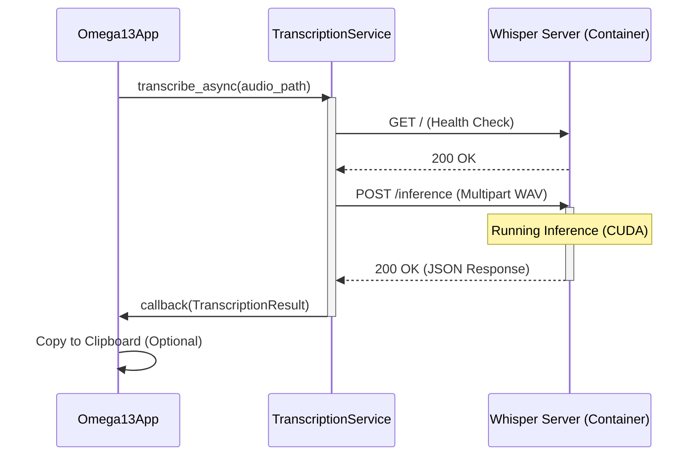

Relevant source files

The following files were used as context for generating this wiki page:
- [compose.yml](https://github.com/b08x/omega-13/blob/main/compose.yml)
- [src/omega13/transcription.py](https://github.com/b08x/omega-13/blob/main/src/omega13/transcription.py)
- [src/omega13/app.py](https://github.com/b08x/omega-13/blob/main/src/omega13/app.py)
- [src/omega13/config.py](https://github.com/b08x/omega-13/blob/main/src/omega13/config.py)
- [README.md](https://github.com/b08x/omega-13/blob/main/README.md)
- [CHANGELOG.md](https://github.com/b08x/omega-13/blob/main/CHANGELOG.md)

# Whisper Server Infrastructure

### 1. Introduction
The Whisper Server Infrastructure serves as the decoupled transcription engine for the Omega-13 retroactive audio recorder. It is architected as a containerized HTTP service that processes WAV audio files into text using the `whisper.cpp` framework. The system relies on a request-response pattern where the Python-based frontend acts as a client, offloading computationally intensive inference to a CUDA-enabled backend. This separation allows the core application to maintain a lightweight TUI while delegating heavy lifting to a specialized environment.

Sources: [README.md](), [src/omega13/transcription.py:#L1-L15]()

### 2. Containerized Deployment and Environment
The infrastructure is defined via a Docker Compose configuration that targets NVIDIA GPU hardware. The service is built from a `Containerfile` and specifically optimized for CUDA execution to handle large-scale models like `ggml-large-v3-turbo`.

#### Service Configuration
| Parameter | Value/Source | Purpose |
| :--- | :--- | :--- |
| Image | `whisper-server-cuda:latest` | Specialized CUDA build of whisper.cpp |
| Port | `8080:8080` | REST API endpoint |
| Model Path | `/app/models/ggml-large-v3-turbo-q5_0.bin` | High-performance quantized model |
| GPU Access | `nvidia.com/gpu=all` | Hardware acceleration requirement |

The container mounts host directories for models and recordings, utilizing `:Z` flags for SELinux compatibility. Curiously, while the system is designed for automation, it requires a manual `docker compose up -d` step before the main application can function correctly, creating a brittle dependency if the container fails to initialize.

Sources: [compose.yml:#L4-L60](), [README.md]()

### 3. Communication Protocol and Data Flow
The interaction between the Omega-13 application and the Whisper server follows a strict HTTP POST sequence. The `TranscriptionService` class manages this lifecycle, including health checks and asynchronous request handling.

#### Transcription Lifecycle Sequence
The following diagram illustrates the flow from a finished recording to a returned transcript.

The implementation includes a "cooperative shutdown" mechanism. If the application initiates a shutdown while a transcription is in progress, the service attempts to truncate the request timeout to 3.0 seconds to prevent the process from hanging. It's a bit of a shit-show if the server is halfway through a large file; the system just cuts the cord.

Sources: [src/omega13/transcription.py:#L55-L95](), [src/omega13/app.py:#L140-L160]()

### 4. Configuration and Integration
The application tracks the server's state through a reactive UI component. The configuration is managed via `config.json`, which stores the server URL and model preferences.

#### Key Configuration Attributes
- **Server URL:** Defaulted to `http://localhost:8080`.
- **Auto-transcribe:** Boolean flag to trigger transcription immediately after recording stops.
- **Model Size:** Configurable, though the `compose.yml` hardcodes the turbo model.

Sources: [src/omega13/config.py:#L30-L45](), [src/omega13/ui.py:#L45-L65]()

### 5. Structural Dependencies and Inconsistencies
The architecture presents an interesting contradiction: the `TranscriptionService` is designed to be optional (wrapped in `try/except` blocks in `app.py`), yet the primary "Usage Workflow" described in the documentation assumes its presence for the "Paste" functionality. If the server is down, the core value proposition of the "retroactive thought capture" is effectively neutered, leaving the user with just a raw WAV file in `/tmp`.

Furthermore, the `compose.yml` uses environment variables like `${HOME}/LLMOS/` which suggests a highly specific, non-standard host directory structure that a user must manually replicate, or the whole goddamn thing fails to find its models.

Sources: [src/omega13/app.py:#L45-L52](), [compose.yml:#L19-L22](), [README.md]()

### Conclusion
The Whisper Server Infrastructure is the backbone of Omega-13's utility, transforming raw audio into actionable text. It is structurally isolated via containerization but operationally coupled through a Python-based HTTP client. While the use of CUDA provides necessary performance, the system's reliance on manual container management and specific host paths introduces significant points of failure in an otherwise automated recording workflow.