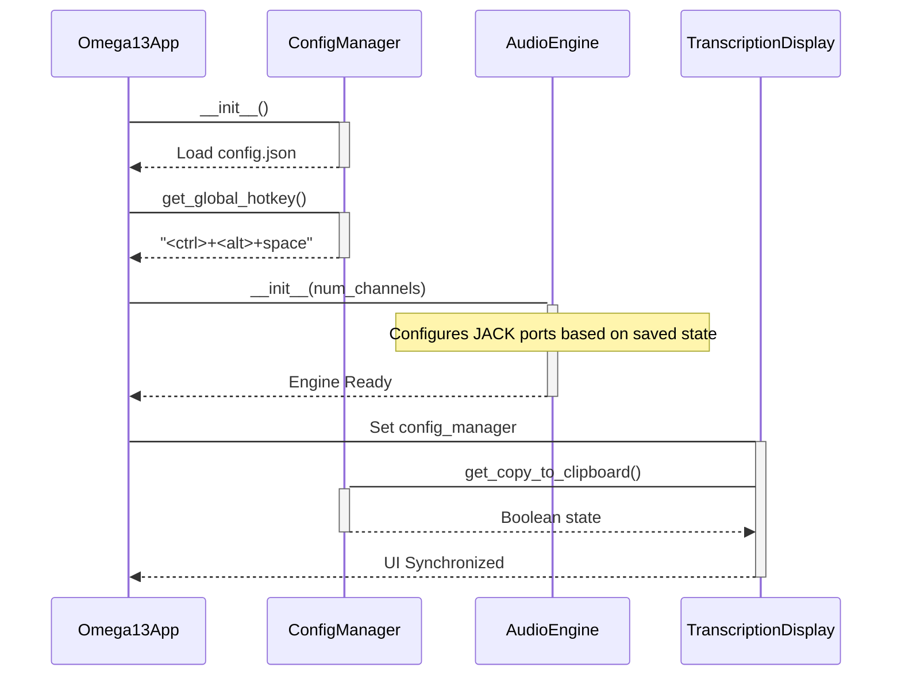

<details>
<summary>Relevant source files</summary>

The following files were used as context for generating this wiki page:
- [src/omega13/config.py](https://github.com/b08x/omega-13/blob/main/src/omega13/config.py)
- [src/omega13/app.py](https://github.com/b08x/omega-13/blob/main/src/omega13/app.py)
- [src/omega13/audio.py](https://github.com/b08x/omega-13/blob/main/src/omega13/audio.py)
- [src/omega13/ui.py](https://github.com/b08x/omega-13/blob/main/src/omega13/ui.py)
- [src/omega13/transcription.py](https://github.com/b08x/omega-13/blob/main/src/omega13/transcription.py)
- [CHANGELOG.md](https://github.com/b08x/omega-13/blob/main/CHANGELOG.md)
</details>

# Configuration & Customization

## 1. Introduction
The Configuration & Customization system in Omega-13 functions as the central nervous system for state persistence and hardware abstraction. It manages the transition between volatile runtime states (audio buffers, active JACK ports) and persistent disk-based settings. The architecture relies on a `ConfigManager` that enforces a schema for audio routing, transcription parameters, and session management. This mechanism ensures that the application can recover its operational context across restarts, specifically targeting the "retroactive" nature of the tool by maintaining pre-configured buffers and hotkeys.

## 2. Configuration Management Architecture
The `ConfigManager` class handles the lifecycle of the `config.json` file, located by default in `~/.config/omega13/`. It utilizes a shallow merge strategy to reconcile user-defined overrides with hardcoded system defaults.

### Key Configuration Schemas
The system tracks several functional domains:
*   **Audio Routing:** Persistence of JACK input ports.
*   **Transcription:** Configuration for the Whisper-server HTTP API, including model size and clipboard behavior.
*   **Session Logic:** Definition of temporary roots and auto-cleanup policies.

| Field | Type | Default | Description |
| :--- | :--- | :--- | :--- |
| `version` | Integer | 2 | Schema versioning. |
| `global_hotkey` | String | `<ctrl>+<alt>+space` | The trigger for audio capture. |
| `save_path` | String | `Path.cwd()` | Default directory for exported recordings. |
| `transcription.server_url` | String | `http://localhost:8080` | Endpoint for the Whisper inference server. |
| `sessions.auto_cleanup_days` | Integer | 7 | Retention period for temporary session data. |

Sources: [src/omega13/config.py:#L24-L65](), [src/omega13/app.py:#L130-L145]()

## 3. Interaction Flow: App Initialization
The following diagram illustrates how the `Omega13App` consumes configuration to bootstrap hardware interfaces and UI elements.


Sources: [src/omega13/app.py:#L125-L160](), [src/omega13/config.py:#L110-L125]()

## 4. Audio & Input Customization
The system presents a contradiction between its flexible configuration and its rigid hardware dependencies. While `config.py` allows for `None` input ports, the `AudioEngine` defaults to 2 channels, and the UI forces a choice between Mono and Stereo.

### Input Port Validation
The application validates saved ports against the active JACK graph. If the configuration points to ports that no longer exist (e.g., a disconnected hardware interface), the UI enters an "Invalid config" state, yet the `AudioEngine` still attempts to initialize with default channel counts—a shitty edge case that can lead to silent recordings if the user doesn't manually intervene.

```python
# src/omega13/audio.py:#L31-L37
self.input_ports = []
for i in range(num_channels):
    self.input_ports.append(self.client.inports.register(f"in_{i+1}"))
```
Sources: [src/omega13/audio.py:#L25-L45](), [src/omega13/ui.py:#L100-L130](), [src/omega13/app.py:#L205-L215]()

## 5. Transcription & Notification Settings
Transcription behavior is governed by the `TranscriptionService`, which depends on the `server_url` defined in the config. A notable structural dependency exists where the `TranscriptionDisplay` widget directly queries the `ConfigManager` to set the initial state of the "Copy to Clipboard" checkbox.

*   **Model Selection:** Defaulted to `large-v3-turbo` in `config.py`.
*   **Clipboard Integration:** Controlled via `copy_to_clipboard` in the transcription sub-dictionary.
*   **Desktop Notifications:** A global toggle that determines if the `DesktopNotifier` is instantiated during app startup.

Sources: [src/omega13/transcription.py:#L35-L55](), [src/omega13/config.py:#L36-L45](), [src/omega13/app.py:#L132-L138]()

## 6. Observed Structural Inconsistencies
The configuration logic exhibits a few "fun" architectural quirks:
1.  **Redundant Keys:** In `src/omega13/config.py`, the `save_to_file` key is defined twice in the default dictionary (lines 41-42), suggesting a copy-paste error in the core schema definition.
2.  **Path Fragility:** The `get_save_path` method defaults to `Path.cwd()` if the configured path does not exist on disk, which can lead to recordings being scattered across various launch directories if the application is invoked from different terminal locations.
3.  **Cooperative Shutdown:** The `TranscriptionService` implements a `_shutdown_event` and a `_lock`, but the `Omega13App` handles the actual signal registration, creating a tight coupling between the UI lifecycle and the network-bound transcription tasks.

Sources: [src/omega13/config.py:#L41-L42](), [src/omega13/config.py:#L100-L108](), [src/omega13/transcription.py:#L56-L60](), [CHANGELOG.md: "Resolve application hang on exit"]()

## Conclusion
Configuration in Omega-13 is not merely a settings file but a state-management layer that bridges the Textual UI, the JACK audio server, and the Whisper inference engine. Its structural significance lies in its ability to normalize hardware inputs (JACK ports) and external service endpoints (Whisper API) into a unified, persistent environment. However, the reliance on manual validation and the presence of redundant schema keys indicate a system that prioritizes functional flexibility over strict data integrity.