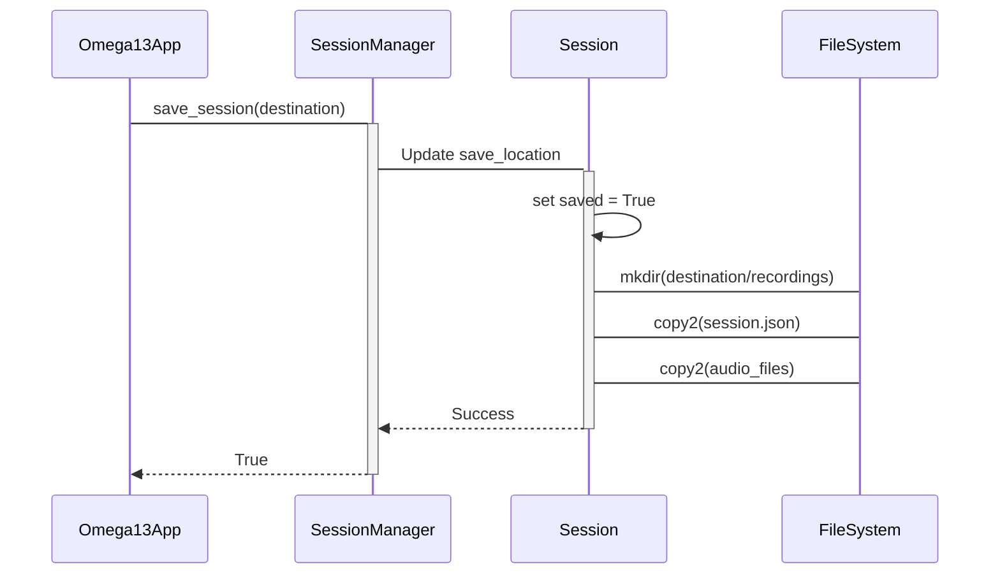

<details>
<summary>Relevant source files</summary>

The following files were used as context for generating this wiki page:
- [src/omega13/session.py](https://github.com/b08x/omega-13/blob/main/src/omega13/session.py)
- [src/omega13/app.py](https://github.com/b08x/omega-13/blob/main/src/omega13/app.py)
- [tests/test_incremental_save.py](https://github.com/b08x/omega-13/blob/main/tests/test_incremental_save.py)
- [tests/test_deduplication.py](https://github.com/b08x/omega-13/blob/main/tests/test_deduplication.py)
- [CHANGELOG.md](https://github.com/b08x/omega-13/blob/main/CHANGELOG.md)
</details>

# Session Management & Data Flow

## Introduction
The session management system in Omega-13 coordinates the lifecycle of retroactive audio captures, metadata persistence, and transcription synchronization. It functions as a stateful bridge between volatile temporary storage (typically `/tmp/omega13`) and permanent user-defined directories. The architecture relies on a hierarchical structure where a `SessionManager` orchestrates `Session` objects, which in turn aggregate `SessionRecording` metadata and deduplicated transcription strings.

Sources: [src/omega13/session.py:#L1-L15](), [src/omega13/app.py:#L1-L25]()

## Session Architecture and Lifecycle
The system enforces a strict transition from temporary "in-flight" data to "saved" permanent data. A session is initialized in a temporary root directory with a unique ID composed of a timestamp and a UUID fragment.

### Component Responsibilities
| Component | Responsibility | Key Data Structures |
| :--- | :--- | :--- |
| `SessionManager` | Lifecycle management: creation, retrieval, saving, and cleanup of sessions. | `current_session`, `temp_root` |
| `Session` | Management of a specific capture event, including directory structure and metadata syncing. | `recordings`, `transcriptions`, `session_dir` |
| `SessionRecording` | Metadata for individual audio files (WAV). | `filename`, `duration_seconds`, `timestamp` |

Sources: [src/omega13/session.py:#L22-L140]()

### Structural Flow of Session Persistence
The following diagram illustrates the transition of audio data and metadata from the active recording state to permanent storage.

```mermaid!
graph TD
    A[App Initialization] --> B[SessionManager.create_session]
    B --> C[Session Object Created]
    C --> D[Temporary Directory Structure]
    D --> D1[/recordings]
    D --> D2[/transcriptions]
    D --> D3[session.json]
    E[Audio Engine Capture] --> F[Session.register_recording]
    F --> G[Update Metadata & Sync]
    G --> H{Is Session Saved?}
    H -- Yes --> I[shutil.copy2 to Permanent Loc]
    H -- No --> J[Stay in Temp Root]
```
Sources: [src/omega13/session.py:#L145-L180](), [src/omega13/app.py:#L30-L50]()

## Transcription Deduplication Mechanism
A notable, albeit somewhat finicky, feature is the word-based suffix-prefix overlap deduplication. When new transcription text is added, the system attempts to strip redundant content that may have been repeated by the transcription engine (e.g., Whisper) across overlapping audio segments.

The logic joins the last 5 transcription segments to create a `history_context` and searches for the longest matching prefix in the `new_words` list.

```python
# src/omega13/session.py
history_context = " ".join(self.transcriptions[-5:]).split()
new_words = new_text.split()

max_overlap = 0
max_search = min(len(history_context), len(new_words))

for i in range(1, max_search + 1):
    if history_context[-i:] == new_words[:i]:
        max_overlap = i
```

Sources: [src/omega13/session.py:#L185-L210](), [tests/test_deduplication.py:#L10-L35]()

## Incremental Saving and Synchronization
The system supports incremental saving, meaning once a session is marked as "saved" via `SessionManager.save_session()`, any subsequent recordings or transcriptions added to the `Session` object are automatically synchronized to the permanent location.

### Observations on Synchronization Constraints
There is a functional dependency where `_sync_to_save_location` silently fails or returns early if `self.saved` is False. This creates a state where data is "trapped" in `/tmp` until the user explicitly triggers a save via the UI. If the application crashes before this trigger, the temporary data is subject to `cleanup_old_sessions` in subsequent runs, which is a cold, efficient way to lose unsaved data.

Sources: [src/omega13/session.py:#L215-L245](), [tests/test_incremental_save.py:#L20-L50]()

## Data Interaction Sequence
The interaction between the UI (`Omega13App`), the `SessionManager`, and the filesystem follows a sequential pattern during a save operation.


Sources: [src/omega13/app.py:#L100-L120](), [src/omega13/session.py:#L260-L290]()

## Structural Significance
The session management logic serves as the primary state machine for Omega-13. By decoupling the `AudioEngine` from the final storage location through a temporary session directory, the system ensures that the overhead of file I/O during time-sensitive audio capture is localized to temporary storage. However, the reliance on manual save triggers to initiate the `_sync_to_save_location` mechanism introduces a rigid boundary between "volatile" and "persistent" states that the user must navigate.

Sources: [CHANGELOG.md](), [src/omega13/session.py]()