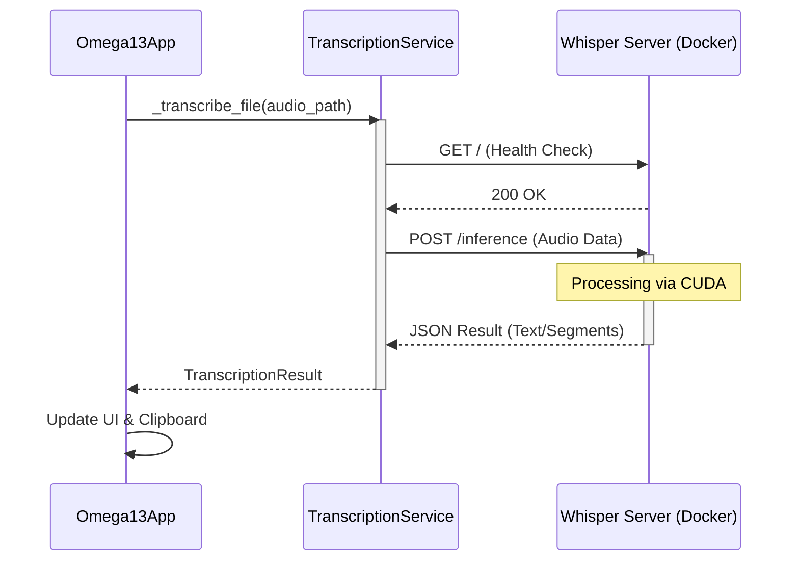

Relevant source files

The following files were used as context for generating this wiki page:
- [compose.yml](https://github.com/b08x/omega-13/blob/main/compose.yml)
- [src/omega13/transcription.py](https://github.com/b08x/omega-13/blob/main/src/omega13/transcription.py)
- [src/omega13/app.py](https://github.com/b08x/omega-13/blob/main/src/omega13/app.py)
- [README.md](https://github.com/b08x/omega-13/blob/main/README.md)
- [CHANGELOG.md](https://github.com/b08x/omega-13/blob/main/CHANGELOG.md)
- [src/omega13/config.py](https://github.com/b08x/omega-13/blob/main/src/omega13/config.py)

# Whisper Server Deployment

## 1. Introduction
The Whisper Server Deployment represents the transcription backbone of the Omega-13 system. It functions as a containerized inference engine that processes audio files via an HTTP API. Structurally, the system decouples the high-latency, resource-intensive transcription task from the real-time audio capture engine. The deployment relies on a CUDA-enabled `whisper.cpp` implementation, facilitating GPU-accelerated speech-to-text processing which is then consumed by the Python-based frontend.

Sources: [compose.yml](), [src/omega13/transcription.py:#L1-L15](), [README.md]()

## 2. Containerized Infrastructure
The deployment is orchestrated via Docker Compose, targeting a specialized CUDA image. The architecture prioritizes performance by mounting host directories for models and recordings, and by exposing hardware-level GPU access to the container.

### Hardware and Resource Allocation
The server is configured to utilize NVIDIA GPUs through the `nvidia-container-toolkit`. Despite being a "server," it operates with significant local dependencies, requiring specific model files (e.g., `ggml-large-v3-turbo-q5_0.bin`) to be present on the host filesystem.

| Feature | Configuration / Value | Source |
| :--- | :--- | :--- |
| Base Image | `whisper-server-cuda:latest` | [compose.yml:#L5]() |
| Port Mapping | `8080:8080` | [compose.yml:#L14-L15]() |
| GPU Access | `nvidia.com/gpu=all` | [compose.yml:#L51-L52]() |
| Memory Limit | `12G` | [compose.yml:#L61]() |
| Default Threads | `8` | [compose.yml:#L42]() |

Sources: [compose.yml:#L5-L61]()

## 3. Communication Protocol and Data Flow
The interaction between the Omega-13 application and the Whisper server follows a request-response pattern over HTTP. The `TranscriptionService` in the Python client manages this lifecycle, including health checks and file uploads.

### Transcription Lifecycle
The system exhibits a rigid dependency on the server's availability. While the audio engine captures data locally, the utility of that data for transcription is entirely contingent on the container's state. The flow follows a sequence of audio finalization, HTTP POST transmission, and asynchronous result handling.

*Note: The system performs a health check before attempting inference to prevent hanging on a dead container.*

Sources: [src/omega13/transcription.py:#L51-L75](), [src/omega13/app.py]()

## 4. Configuration and Environment Variables
The server's behavior is dictated by environment variables and command-line flags defined in the compose file. These settings control the model path, threading, and specific inference optimizations.

| Variable | Role | Observed Behavior |
| :--- | :--- | :--- |
| `WHISPER_MODEL` | Path to GGML model | Mandatory for server start. |
| `WHISPER_THREADS` | CPU thread count | Set to 8 by default for parallel processing. |
| `--convert` | Audio conversion | Enables ffmpeg-based pre-processing within the container. |
| `--nf` | No fallback | Forces deterministic, faster inference by disabling temperature fallback. |

Sources: [compose.yml:#L26-L45]()

## 5. Structural Observations and Dependencies
The deployment reveals a "cooperative" but fragile relationship between the host and the container.

*   **Implicit Dependency Path:** The `compose.yml` uses hardcoded paths like `${HOME}/LLMOS/whisper.cpp/models`. If this specific directory structure doesn't exist on the host, the container fails silently or throws mount errors. It’s a fucking brittle way to handle model distribution, requiring the user to manually populate the host filesystem before the "automated" deployment works.
*   **Networking:** The `TranscriptionService` defaults to `http://localhost:8080`. While configurable via `config.json`, the application assumes a local or bridge-networked container by default.
*   **Shutdown Mechanism:** The `TranscriptionService` implements a `_shutdown_event` (threading.Event) to allow for cooperative shutdown, ensuring that if the app exits, it doesn't leave orphaned HTTP requests hanging indefinitely.

Sources: [compose.yml:#L19-L20](), [src/omega13/transcription.py:#L48](), [src/omega13/config.py:#L30]()

## 6. Conclusion
The Whisper Server Deployment is the heavy-lifting component of the Omega-13 architecture. It successfully abstracts complex CUDA/C++ dependencies behind a standard HTTP interface, allowing the Textual-based UI to remain responsive. However, the structural integrity of the system relies heavily on the user's local environment matching the expected volume mounts and GPU drivers, creating a high-friction boundary between the Python application and its transcription capabilities.

Sources: [compose.yml](), [README.md](), [CHANGELOG.md]()