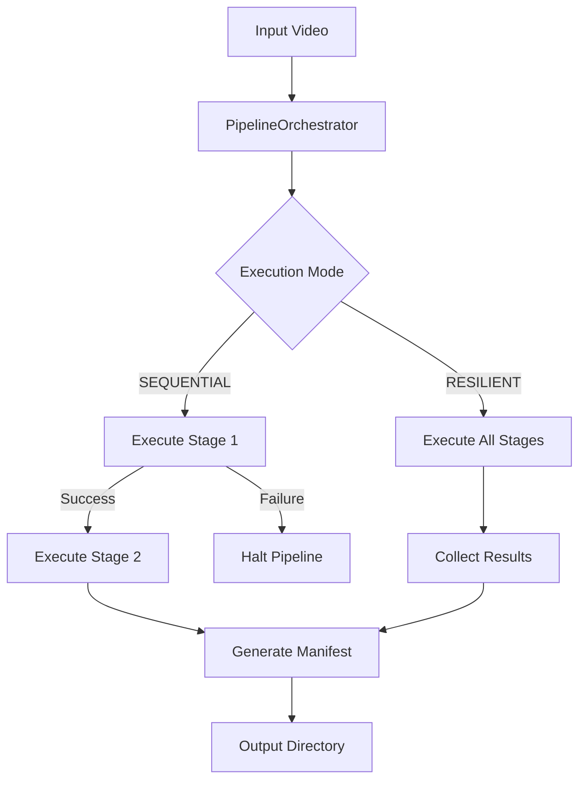

<details>
<summary>Relevant source files</summary>

The following files were used as context for generating this wiki page:
- [src/video_chapter_automater/output/manager.py](https://github.com/b08x/video-chapter-automater/blob/main/src/video_chapter_automater/output/manager.py)
- [src/video_chapter_automater/setup_wizard.py](https://github.com/b08x/video-chapter-automater/blob/main/src/video_chapter_automater/setup_wizard.py)
- [src/video_chapter_automater/main.py](https://github.com/b08x/video-chapter-automater/blob/main/src/video_chapter_automater/main.py)
- [src/video_chapter_automater/pipeline/config.py](https://github.com/b08x/video-chapter-automater/blob/main/src/video_chapter_automater/pipeline/config.py)
- [src/video_chapter_automater/pipeline/orchestrator.py](https://github.com/b08x/video-chapter-automater/blob/main/src/video_chapter_automater/pipeline/orchestrator.py)
- [src/video_chapter_automater/app_paths.py](https://github.com/b08x/video-chapter-automater/blob/main/src/video_chapter_automater/app_paths.py)
- [src/video_chapter_automater/preprocessing/base.py](https://github.com/b08x/video-chapter-automater/blob/main/src/video_chapter_automater/preprocessing/base.py)
</details>

# Introduction

Video Chapter Automater is a structured system designed for the automated generation of video chapters through AI-powered scene detection and hardware-accelerated preprocessing. The system is architected around a multi-stage pipeline that coordinates video re-encoding, audio extraction, and scene analysis. It relies on a centralized management of system paths and output directories to maintain state across complex processing tasks.

The system's behavior is governed by a `PipelineOrchestrator` that manages `Stage` execution based on a `PipelineConfig`. This orchestration ensures that dependencies between media extraction and analysis are satisfied, while a `SetupWizard` handles the initial environment validation and GPU capability detection.

## System Architecture and Orchestration

The core of the system is the pipeline mechanism, which transitions a raw video file through various states of extraction and metadata generation.

### Pipeline Execution Flow

The `PipelineOrchestrator` is the primary controller. It initializes the `OutputManager` and iterates through a list of `StageConfig` objects. The execution mode determines how failures are handled, specifically through `SEQUENTIAL` or `RESILIENT` modes.


*Note: The orchestrator explicitly manages the lifecycle of the process, from source copying to manifest generation.*
Sources: `[src/video_chapter_automater/pipeline/orchestrator.py:L26-L85]`, `[src/video_chapter_automater/pipeline/config.py:L31-L45]`

### Component Responsibilities

| Component | Responsibility | Key Interactions |
| :--- | :--- | :--- |
| `OutputManager` | Centralized I/O and directory structure maintenance. | Interacts with `PipelineOrchestrator` to store stage outputs. |
| `PipelineOrchestrator` | Manages the lifecycle of preprocessing stages. | Coordinates `Stage` objects and `OutputManager`. |
| `SetupWizard` | Environment validation and user preference configuration. | Detects GPU via `GPUDetector` and sets `UserPreferences`. |
| `ApplicationPaths` | Platform-agnostic path resolution (Config, Data, Cache). | Used by `EnhancedVideoProcessor` for state persistence. |
| `PreprocessingOperation` | Abstract contract for specific tasks (Encoding, Extraction). | Implemented by specific logic in the pipeline. |

Sources: `[src/video_chapter_automater/output/manager.py:L106-L135]`, `[src/video_chapter_automater/pipeline/orchestrator.py:L10-L30]`, `[src/video_chapter_automater/app_paths.py:L21-L45]`

## Output and State Management

The system utilizes a rigid directory structure to organize the artifacts of the preprocessing stages. This structure is enforced by the `OutputManager`, which maps `OutputType` enums to specific subdirectories.

### Directory Structure Mapping

The system automatically generates a structured hierarchy under a base directory (defaulting to `./vca_output`).

- **video/**: Re-encoded video files.
- **audio/**: Extracted 16kHz mono WAV files.
- **scenes/**: PNG images organized by video name.
- **chapters/**: FFmpeg metadata format markers.
- **metadata/**: JSON manifests and statistics.

Sources: `[src/video_chapter_automater/output/manager.py:L13-L55]`, `[src/video_chapter_automater/output/manager.py:L137-L148]`

### The Manifest Mechanism

Upon successful pipeline completion, the orchestrator generates a manifest. This file acts as the "source of truth" for a specific processing run, containing timestamps, paths to all generated outputs, and processing statistics.

```python
# Conceptual structure of manifest generation

def _generate_manifest(self, input_path: Path, stage_results: List[StageResult], duration: float):
    # Aggregates metadata from all stages into a single JSON file
    pass
```
Sources: `[src/video_chapter_automater/pipeline/orchestrator.py:L80-L85]`, `[src/video_chapter_automater/output/manager.py:L57-L65]`

## Initialization and Configuration

The `SetupWizard` and `ApplicationPaths` handle the system's "pre-flight" state. The `SetupWizard` uses a TUI (Text User Interface) to guide users through GPU detection and dependency installation.

### Configuration Hierarchy

1. **UserPreferences**: High-level settings (GPU preference, output format, parallel processing).
2. **PipelineConfig**: Low-level execution settings (Stage ordering, cleanup policies, project naming).
3. **StageConfig**: Specific parameters for individual operations (Scene detection thresholds, codecs).

Sources: `[src/video_chapter_automater/setup_wizard.py:L62-L85]`, `[src/video_chapter_automater/pipeline/config.py:L55-L75]`

### Observed Structural Inconsistencies

The system presents an interesting contradiction in its parallel processing implementation. While `ExecutionMode.PARALLEL` is defined in the configuration and exposed in the `UserPreferences`, the `PipelineOrchestrator` contains a fucking placeholder that defaults parallel requests back to sequential execution. This reveals a design that is architecturally "ready" for concurrency but functionally restricted to synchronous flows in its current iteration.

Sources: `[src/video_chapter_automater/pipeline/config.py:L43-L45]`, `[src/video_chapter_automater/pipeline/orchestrator.py:L72-L75]`

## Conclusion

The Video Chapter Automater is a modular, pipeline-driven system that prioritizes structural organization and hardware utilization. By decoupling the preprocessing operations from the orchestration logic, the system maintains a clear flow of data from raw video to structured metadata. Its reliance on centralized path management and automated environment setup indicates a focus on reproducibility and cross-platform stability, despite some internal components remaining in a transitional state regarding parallel execution.