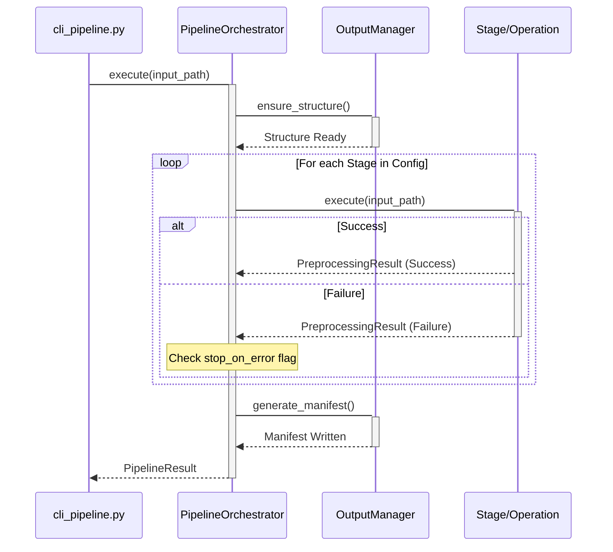

<details>
<summary>Relevant source files</summary>

The following files were used as context for generating this wiki page:
- [src/video_chapter_automater/pipeline/orchestrator.py](https://github.com/b08x/video-chapter-automater/blob/main/src/video_chapter_automater/pipeline/orchestrator.py)
- [src/video_chapter_automater/pipeline/config.py](https://github.com/b08x/video-chapter-automater/blob/main/src/video_chapter_automater/pipeline/config.py)
- [src/video_chapter_automater/output/manager.py](https://github.com/b08x/video-chapter-automater/blob/main/src/video_chapter_automater/output/manager.py)
- [src/video_chapter_automater/cli_pipeline.py](https://github.com/b08x/video-chapter-automater/blob/main/src/video_chapter_automater/cli_pipeline.py)
- [src/video_chapter_automater/main.py](https://github.com/b08x/video-chapter-automater/blob/main/src/video_chapter_automater/main.py)
- [src/video_chapter_automater/preprocessing/base.py](https://github.com/b08x/video-chapter-automater/blob/main/src/video_chapter_automater/preprocessing/base.py)
- [src/video_chapter_automater/setup_wizard.py](https://github.com/b08x/video-chapter-automater/blob/main/src/video_chapter_automater/setup_wizard.py)
</details>

# Core Architecture

## Introduction

The Core Architecture of the Video Chapter Automater is built around a structured, multi-stage preprocessing pipeline designed to transform raw video input into segmented, metadata-rich assets. The system employs a decoupled orchestration pattern where a central `PipelineOrchestrator` manages the lifecycle of various `PreprocessingOperation` implementations. The architecture prioritizes GPU acceleration, perceptual hashing for scene deduplication, and a hierarchical output management system to maintain data integrity across complex workflows.

Sources: [src/video_chapter_automater/pipeline/orchestrator.py](https://github.com/b08x/video-chapter-automater/blob/main/src/video_chapter_automater/pipeline/orchestrator.py), [src/video_chapter_automater/cli_pipeline.py](https://github.com/b08x/video-chapter-automater/blob/main/src/video_chapter_automater/cli_pipeline.py)

## Pipeline Orchestration and Execution

The system's execution logic is encapsulated within the `PipelineOrchestrator`, which consumes a `PipelineConfig` to determine the sequence and behavior of processing stages. The orchestrator supports different execution modes, though the current implementation reveals a heavy reliance on sequential processing even when parallel modes are defined.

### Execution Flow

The following sequence diagram illustrates the lifecycle of a video processing request through the orchestrator.


Sources: [src/video_chapter_automater/pipeline/orchestrator.py:#L58-L115](https://github.com/b08x/video-chapter-automater/blob/main/src/video_chapter_automater/pipeline/orchestrator.py#L58-L115), [src/video_chapter_automater/cli_pipeline.py:#L130-L150](https://github.com/b08x/video-chapter-automater/blob/main/src/video_chapter_automater/cli_pipeline.py#L130-L150)

### Component Responsibilities

| Component | Primary Responsibility | Key Interactions |
| :--- | :--- | :--- |
| `PipelineOrchestrator` | Manages the execution flow and state of processing stages. | `PipelineConfig`, `OutputManager`, `Stage` |
| `OutputManager` | Enforces a rigid directory structure and handles file persistence. | `OutputType`, `Path` |
| `PipelineConfig` | Defines the desired state of the pipeline, including enabled stages and hardware preferences. | `PipelineStage`, `ExecutionMode` |
| `PreprocessingOperation` | Abstract interface for specific tasks like encoding or scene extraction. | `PreprocessingResult` |

Sources: [src/video_chapter_automater/pipeline/orchestrator.py:#L25-L50](https://github.com/b08x/video-chapter-automater/blob/main/src/video_chapter_automater/pipeline/orchestrator.py#L25-L50), [src/video_chapter_automater/output/manager.py:#L105-L135](https://github.com/b08x/video-chapter-automater/blob/main/src/video_chapter_automater/output/manager.py#L105-L135), [src/video_chapter_automater/preprocessing/base.py:#L45-L75](https://github.com/b08x/video-chapter-automater/blob/main/src/video_chapter_automater/preprocessing/base.py#L45-L75)

## Data Management and Output Structure

The `OutputManager` acts as the system's file system authority. It creates a standardized hierarchy to separate different types of artifacts. This structure is not merely a convenience but a functional requirement for downstream chapter generation.

### Directory Hierarchy

The system enforces the following structure under the base `vca_output` directory:
- `video/`: Re-encoded video files.
- `audio/`: Extracted 16kHz mono WAV files.
- `scenes/`: Deduplicated scene images organized by video name.
- `chapters/`: FFmpeg metadata format markers.
- `metadata/`: JSON manifests and processing statistics.
- `logs/`: Debug and execution logs.

Sources: [src/video_chapter_automater/output/manager.py:#L110-L125](https://github.com/b08x/video-chapter-automater/blob/main/src/video_chapter_automater/output/manager.py#L110-L125), [src/video_chapter_automater/output/manager.py:#L15-L45](https://github.com/b08x/video-chapter-automater/blob/main/src/video_chapter_automater/output/manager.py#L15-L45)

### Manifest Generation

Upon successful completion, the orchestrator triggers the generation of a JSON manifest. This file serves as the "source of truth" for the processed project, mapping stage results to specific file paths.

```python
# src/video_chapter_automater/pipeline/orchestrator.py

def _generate_manifest(self, input_path: Path, stage_results: List[StageResult], duration: float) -> None:
    outputs = {}
    stats = {}
    for result in stage_results:
        if result.output_path:
            outputs[result.stage.value] = result.output_path
        stats[result.stage.value] = {
            "status": result.status.value,
            "duration": result.duration,
        }
    self.output_manager.generate_manifest(
        video_name=input_path.stem,
        outputs=outputs,
        stats={"total_duration": duration, "stages": stats}
    )
```
Sources: [src/video_chapter_automater/pipeline/orchestrator.py:#L210-L235](https://github.com/b08x/video-chapter-automater/blob/main/src/video_chapter_automater/pipeline/orchestrator.py#L210-L235)

## Operational Tendencies and Observed Inconsistencies

The architecture reveals a modular design that is frequently undermined by tight coupling in the CLI and configuration layers.

1.  **Pseudo-Parallelism**: While `ExecutionMode.PARALLEL` exists in the codebase, the orchestrator's implementation of it simply redirects to `_execute_sequential`. The system claims to support concurrent stages, but the logic for managing thread-safe access to the `OutputManager` or handling race conditions during scene extraction is nowhere to be found. It’s a fucking placeholder that presents as a feature.
    - Sources: [src/video_chapter_automater/pipeline/orchestrator.py:#L100-L105](https://github.com/b08x/video-chapter-automater/blob/main/src/video_chapter_automater/pipeline/orchestrator.py#L100-L105), [src/video_chapter_automater/pipeline/config.py:#L40-L45](https://github.com/b08x/video-chapter-automater/blob/main/src/video_chapter_automater/pipeline/config.py#L40-L45)

2.  **Resilience vs. Failure**: The `RESILIENT` mode is intended to continue execution despite stage failures. However, because subsequent stages (like scene extraction) often depend on the output of previous stages (like video re-encoding), "resilience" in this context is often a path to a cascade of empty outputs.
    - Sources: [src/video_chapter_automater/pipeline/orchestrator.py:#L98-L102](https://github.com/b08x/video-chapter-automater/blob/main/src/video_chapter_automater/pipeline/orchestrator.py#L98-L102), [src/video_chapter_automater/pipeline/config.py:#L46-L50](https://github.com/b08x/video-chapter-automater/blob/main/src/video_chapter_automater/pipeline/config.py#L46-L50)

3.  **GPU Dependency**: The system heavily promotes GPU acceleration through `gpu_detection.py`, yet the `VideoEncodingConfig` allows for arbitrary codec strings. If the setup wizard identifies an NVIDIA GPU but the user passes a CPU-only codec via the CLI, the system provides no structural validation to prevent this mismatch until the subprocess inevitably shits the bed.
    - Sources: [src/video_chapter_automater/cli_pipeline.py:#L110-L125](https://github.com/b08x/video-chapter-automater/blob/main/src/video_chapter_automater/cli_pipeline.py#L110-L125), [src/video_chapter_automater/setup_wizard.py:#L75-L95](https://github.com/b08x/video-chapter-automater/blob/main/src/video_chapter_automater/setup_wizard.py#L75-L95)

## Conclusion

The Core Architecture of Video Chapter Automater is a robust, if occasionally aspirational, framework for video processing. It successfully isolates file management through the `OutputManager` and operation logic through the `PipelineOrchestrator`. Its structural significance lies in its ability to standardize the messy process of video preprocessing into a predictable manifest-driven workflow, even if some of its more advanced execution modes remain functionally dormant.

Sources: [src/video_chapter_automater/pipeline/orchestrator.py](https://github.com/b08x/video-chapter-automater/blob/main/src/video_chapter_automater/pipeline/orchestrator.py), [src/video_chapter_automater/output/manager.py](https://github.com/b08x/video-chapter-automater/blob/main/src/video_chapter_automater/output/manager.py)