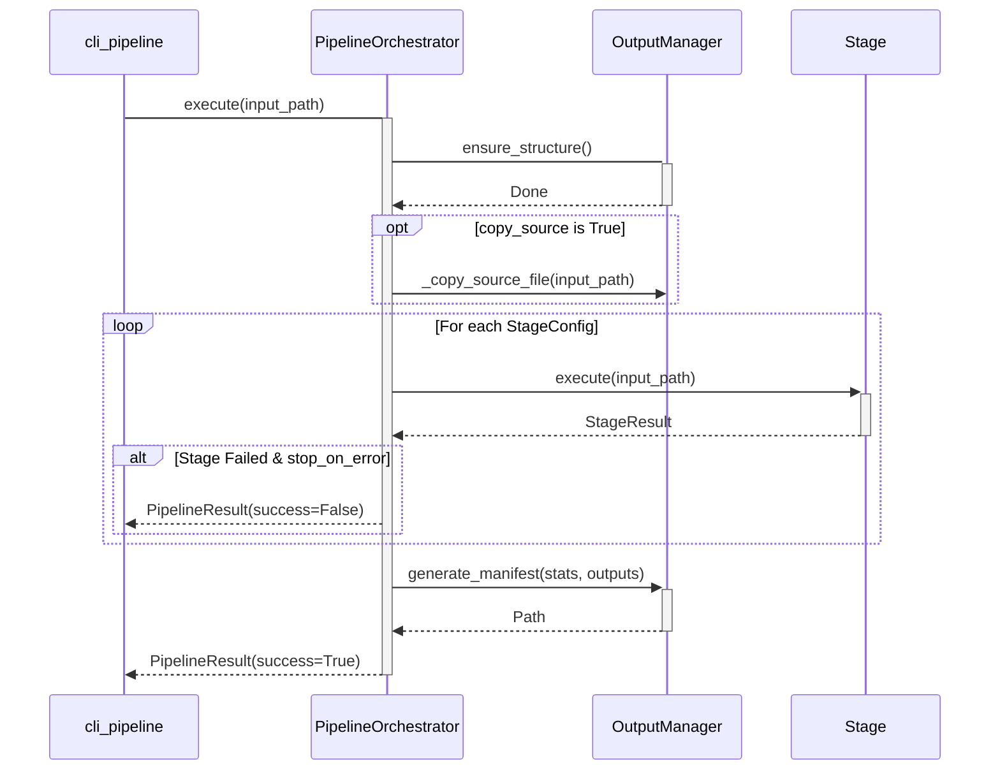

Relevant source files

The following files were used as context for generating this wiki page:
- [src/video_chapter_automater/pipeline/orchestrator.py](https://github.com/b08x/video-chapter-automater/blob/main/src/video_chapter_automater/pipeline/orchestrator.py)
- [src/video_chapter_automater/pipeline/config.py](https://github.com/b08x/video-chapter-automater/blob/main/src/video_chapter_automater/pipeline/config.py)
- [src/video_chapter_automater/output/manager.py](https://github.com/b08x/video-chapter-automater/blob/main/src/video_chapter_automater/output/manager.py)
- [src/video_chapter_automater/cli_pipeline.py](https://github.com/b08x/video-chapter-automater/blob/main/src/video_chapter_automater/cli_pipeline.py)
- [tests/pipeline/test_orchestrator.py](https://github.com/b08x/video-chapter-automater/blob/main/tests/pipeline/test_orchestrator.py)
- [src/video_chapter_automater/pipeline/__init__.py](https://github.com/b08x/video-chapter-automater/blob/main/src/video_chapter_automater/pipeline/__init__.py)

# Pipeline Orchestration

The pipeline orchestration system provides a structured framework for executing multi-stage video preprocessing workflows. It manages the lifecycle of processing tasks—ranging from video encoding to scene extraction—by coordinating configuration, output directory management, and execution flow. The system is designed to transform raw video input into a set of structured assets (audio, scenes, metadata) required for downstream chapter generation.

Sources: `[src/video_chapter_automater/pipeline/orchestrator.py]`, `[src/video_chapter_automater/pipeline/config.py]`

## Architectural Components

The architecture relies on a strict separation between configuration (what to do), orchestration (how to execute), and output management (where to store results).

### Component Responsibilities

| Component | Responsibility | Primary Class |
| :--- | :--- | :--- |
| **Configuration** | Defines stages, execution modes, and global parameters. | `PipelineConfig` |
| **Orchestration** | Manages the execution flow and state transitions of stages. | `PipelineOrchestrator` |
| **Output Management** | Handles directory creation, file naming, and manifest generation. | `OutputManager` |
| **Execution Unit** | Wraps individual preprocessing operations with status tracking. | `Stage` |

Sources: `[src/video_chapter_automater/pipeline/config.py]`, `[src/video_chapter_automater/pipeline/orchestrator.py]`, `[src/video_chapter_automater/output/manager.py]`

## Execution Flow and Data Movement

The `PipelineOrchestrator` coordinates the movement of data between stages. While the system claims to support multiple execution modes, the internal logic reveals a rigid dependency on sequential processing for manifest generation and error handling.

### Pipeline Execution Sequence

The following diagram illustrates the lifecycle of a pipeline execution from the initial input to the final manifest generation.

Sources: `[src/video_chapter_automater/pipeline/orchestrator.py:#L128-L195]`, `[src/video_chapter_automater/cli_pipeline.py:#L120-L150]`

## Configuration and Stage Management

Pipeline behavior is dictated by `PipelineConfig`, which aggregates multiple `StageConfig` objects. The system supports three distinct stages, though the orchestration logic implies a functional hierarchy where video encoding often precedes extraction tasks.

### Available Pipeline Stages
- **VIDEO_ENCODING**: Re-encodes video using GPU acceleration or specific codecs.
- **AUDIO_EXTRACTION**: Extracts 16kHz mono WAV files for transcription.
- **SCENE_EXTRACTION**: Extracts visual frames for scene detection.

Sources: `[src/video_chapter_automater/pipeline/config.py:#L26-L36]`, `[src/video_chapter_automater/output/manager.py:#L14-L25]`

### Execution Modes
The `ExecutionMode` enum defines how the system handles the progression of stages:
1. **SEQUENTIAL**: Standard one-by-one execution.
2. **RESILIENT**: Continues execution even if individual stages fail.
3. **PARALLEL**: Defined in code but explicitly noted as a "future enhancement," effectively defaulting back to sequential execution in the current implementation.

Sources: `[src/video_chapter_automater/pipeline/config.py:#L39-L49]`, `[src/video_chapter_automater/pipeline/orchestrator.py:#L158-L164]`

## Output Organization and Manifests

The `OutputManager` enforces a standardized directory structure. A recurring pattern in the architecture is the use of a "project folder" which, if provided, nests all outputs under a specific subdirectory, effectively isolating different processing runs.

### Directory Structure Mapping
The `OutputManager` maintains a mapping between `OutputType` and physical subdirectories:
- `video/`: Re-encoded video files.
- `audio/`: Extracted WAV files.
- `scenes/`: PNG frames organized by video name.
- `metadata/`: JSON manifests and processing statistics.
- `source/`: Optional copy of the original input file.

Sources: `[src/video_chapter_automater/output/manager.py:#L90-L105]`, `[src/video_chapter_automater/output/manager.py:#L123-L135]`

### The Manifest Mechanism
Upon successful completion, the orchestrator triggers `_generate_manifest`. This function aggregates `StageResult` data, including execution duration and output paths, into a JSON file stored in the `metadata/` directory. This serves as the single source of truth for the processed state of a video.

Sources: `[src/video_chapter_automater/pipeline/orchestrator.py:#L215-L242]`

## Structural Observations and Contradictions

The orchestration logic exhibits several interesting, if somewhat irritating, structural tendencies:

- **The Parallelism Illusion**: The `ExecutionMode` includes a `PARALLEL` option, yet the `PipelineOrchestrator.execute` method explicitly redirects parallel requests to `_execute_sequential`. The system architecture presents an interface for concurrency that the implementation simply ignores.
- **Source Redundancy**: If `copy_source` is enabled, the system duplicates the input video into the `source/` subdirectory before processing. While this ensures project portability, it creates immediate storage overhead before any actual "processing" occurs.
- **Manifest Dependency**: Manifest generation is coupled to the overall success of the pipeline. In `RESILIENT` mode, if a non-critical stage fails but the pipeline technically "succeeds," the manifest is still generated, potentially leading to downstream consumers finding missing expected assets.

Sources: `[src/video_chapter_automater/pipeline/orchestrator.py:#L162-L164]`, `[tests/pipeline/test_orchestrator.py:#L150-L170]`

## Summary

Pipeline Orchestration in this repository serves as a centralized state machine that converts high-level CLI arguments into a sequence of file-system operations. Its structural significance lies in its ability to abstract the complexities of FFmpeg and image processing into a repeatable "Stage" based workflow. However, the architecture is currently optimized for sequential, synchronous execution, with hooks for parallelism and resilience that are either partially implemented or functionally bypassed by the main orchestration loop.