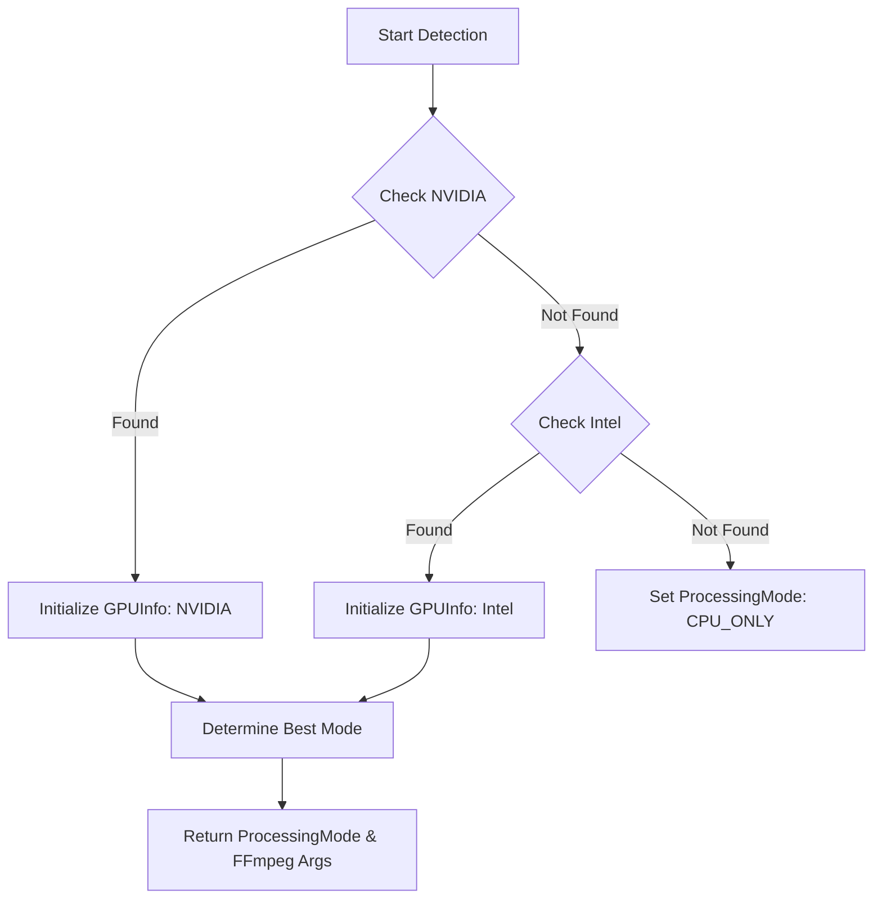
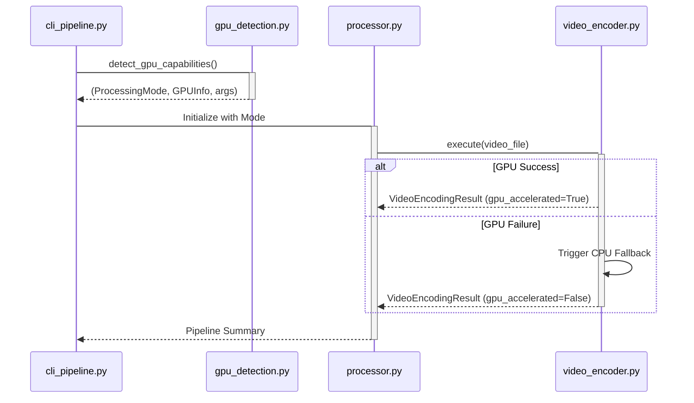

<details>
<summary>Relevant source files</summary>

The following files were used as context for generating this wiki page:
- [src/video_chapter_automater/gpu_detection.py](https://github.com/b08x/video-chapter-automater/blob/main/src/video_chapter_automater/gpu_detection.py)
- [src/video_chapter_automater/preprocessing/video_encoder.py](https://github.com/b08x/video-chapter-automater/blob/main/src/video_chapter_automater/preprocessing/video_encoder.py)
- [src/video_chapter_automater/processor.py](https://github.com/b08x/video-chapter-automater/blob/main/src/video_chapter_automater/processor.py)
- [src/video_chapter_automater/cli_pipeline.py](https://github.com/b08x/video-chapter-automater/blob/main/src/video_chapter_automater/cli_pipeline.py)
- [src/video_chapter_automater/main.py](https://github.com/b08x/video-chapter-automater/blob/main/src/video_chapter_automater/main.py)
- [src/video_chapter_automater/setup_wizard.py](https://github.com/b08x/video-chapter-automater/blob/main/src/video_chapter_automater/setup_wizard.py)
</details>

# GPU Acceleration & Detection

## Introduction
The GPU Acceleration & Detection system in Video Chapter Automater is a diagnostic and orchestration layer designed to identify hardware capabilities and apply optimized encoding paths. It functions as a hardware abstraction layer that determines whether the system can leverage NVIDIA (NVENC) or Intel (QuickSync) hardware encoders versus falling back to software-based CPU encoding. This mechanism is central to the `vca-pipeline`, where it dictates the selection of codec strategies during the video re-encoding stage.

Sources: [src/video_chapter_automater/gpu_detection.py](), [src/video_chapter_automater/preprocessing/video_encoder.py]()

## Hardware Detection Mechanism
The system utilizes the `GPUDetector` class to probe the host environment for specific vendor signatures and driver support. It primarily targets NVIDIA and Intel hardware through shell-level probes and subprocess calls.

### Detection Logic Flow
The detection process follows a hierarchical search, prioritizing NVIDIA hardware before checking for Intel integrated graphics.


The `detect_all_gpus` method populates a list of `GPUInfo` objects, which include metadata such as vendor name, memory, and driver versions.

Sources: [src/video_chapter_automater/gpu_detection.py:#L46-L70]()

### GPU Metadata Structures
| Attribute | Type | Description |
| :--- | :--- | :--- |
| `vendor` | `GPUVendor` | Enum: NVIDIA, INTEL, or UNKNOWN |
| `name` | `str` | Marketing name of the detected hardware |
| `processing_mode` | `ProcessingMode` | Determines the specific FFmpeg acceleration path (e.g., `nvidia_gpu`) |

Sources: [src/video_chapter_automater/gpu_detection.py:#L21-L40]()

## Integration with Video Encoding
GPU detection results are consumed by the `VideoEncoder` and its associated `CodecStrategy` implementations. The system maps specific hardware modes to FFmpeg-compatible encoder strings.

### Codec Strategy Mapping
The `VideoEncoder` maintains a mapping of strategy classes that handle the technical implementation of different encoding paths.

| Strategy Key | Class | Target Hardware |
| :--- | :--- | :--- |
| `h264_nvenc` | `H264NvencStrategy` | NVIDIA GPU (H.264) |
| `hevc_nvenc` | `HevcNvencStrategy` | NVIDIA GPU (H.265) |
| `libx264` | `LibX264Strategy` | CPU (Software H.264) |

Sources: [src/video_chapter_automater/preprocessing/video_encoder.py:#L57-L63]()

### The Fallback Mechanism
A notable structural pattern is the "interactive fallback." If a GPU-accelerated encoding attempt fails (e.g., due to driver issues or unsupported profiles), the `VideoEncoder` catches the `GPUEncodingError` and prompts the user to switch to CPU encoding. This reveals a dependency where the system assumes hardware capability until the actual execution phase fails.

```python
# Observed fallback logic in VideoEncoder
try:
    result = self.strategy.execute(input_path, config)
except GPUEncodingError:
    if self.interactive and Confirm.ask("GPU encoding failed. Fallback to CPU?"):
        self.strategy = LibX264Strategy()
        result = self.strategy.execute(input_path, config)
```

Sources: [src/video_chapter_automater/preprocessing/video_encoder.py:#L45-L55]()

## Pipeline Orchestration
The `vca-pipeline` CLI command uses the detection module to provide users with immediate feedback on their system's capabilities before long-running tasks begin.

### Execution Sequence
The following sequence illustrates how the CLI coordinates with the detection and processing components:



Sources: [src/video_chapter_automater/cli_pipeline.py:#L170-L190](), [src/video_chapter_automater/processor.py:#L60-L80]()

## Structural Observations
The architecture presents a clean separation between detection (`gpu_detection.py`) and execution (`video_encoder.py`). However, an analytical look reveals that while the `GPUDetector` is quite thorough, the actual `VideoProcessor` in `processor.py` often treats GPU acceleration as an "all-or-nothing" flag. This is a fucking annoying inconsistency: the system detects specific hardware details (like memory and driver versions) but often collapses that complexity into a simple boolean `gpu_acceleration` in the `ProcessingStats` dataclass.

Sources: [src/video_chapter_automater/main.py:#L68-L80](), [src/video_chapter_automater/gpu_detection.py:#L120-L140]()

## Conclusion
GPU Acceleration & Detection serves as the performance-critical foundation of the Video Chapter Automater. By abstracting vendor-specific FFmpeg arguments into `ProcessingMode` enums and `CodecStrategy` classes, the system ensures that high-intensity scene detection and re-encoding tasks can scale with available hardware while maintaining a mandatory (if slightly pessimistic) CPU fallback path.