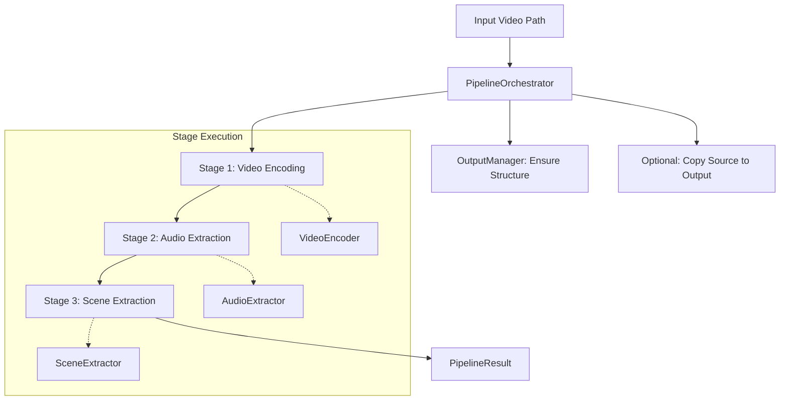
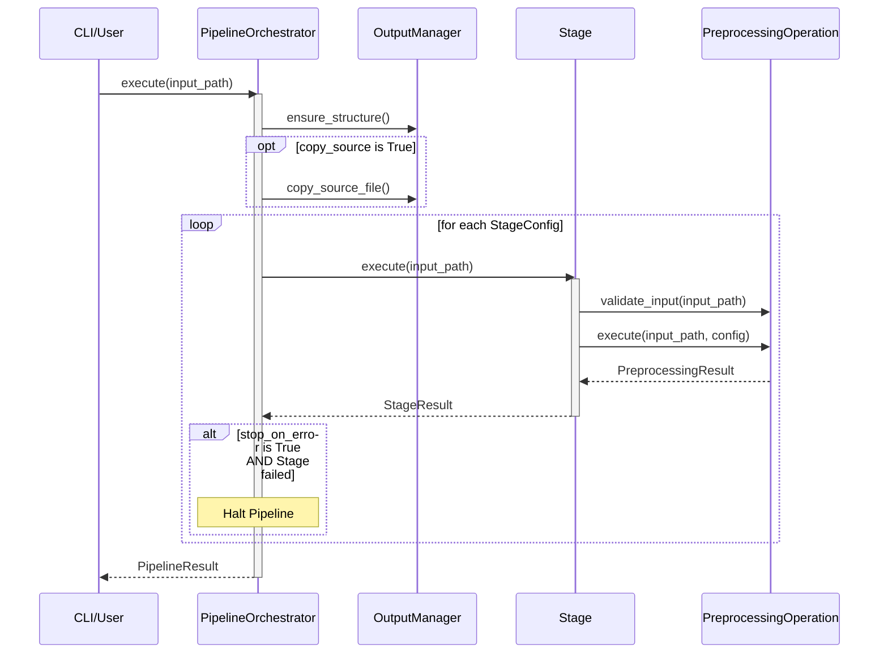

<details>
<summary>Relevant source files</summary>

The following files were used as context for generating this wiki page:
- [src/video_chapter_automater/pipeline/config.py](https://github.com/b08x/video-chapter-automater/blob/main/src/video_chapter_automater/pipeline/config.py)
- [src/video_chapter_automater/pipeline/orchestrator.py](https://github.com/b08x/video-chapter-automater/blob/main/src/video_chapter_automater/pipeline/orchestrator.py)
- [src/video_chapter_automater/pipeline/stage.py](https://github.com/b08x/video-chapter-automater/blob/main/src/video_chapter_automater/pipeline/stage.py)
- [src/video_chapter_automater/preprocessing/base.py](https://github.com/b08x/video-chapter-automater/blob/main/src/video_chapter_automater/preprocessing/base.py)
- [src/video_chapter_automater/output/manager.py](https://github.com/b08x/video-chapter-automater/blob/main/src/video_chapter_automater/output/manager.py)
- [src/video_chapter_automater/cli_pipeline.py](https://github.com/b08x/video-chapter-automater/blob/main/src/video_chapter_automater/cli_pipeline.py)
</details>

# Preprocessing Stages

## Introduction
The preprocessing stages in `video-chapter-automater` constitute a modular workflow designed to transform raw video input into structured assets required for chapter generation. This system operates as a managed pipeline where individual operations—video re-encoding, audio extraction, and scene detection—are encapsulated as discrete stages. The architecture enforces a strict separation between high-level orchestration, stage-specific configuration, and the underlying execution logic.

Sources: [src/video_chapter_automater/pipeline/config.py:#L21-L30](), [src/video_chapter_automater/pipeline/orchestrator.py:#L1-L10]()

## Pipeline Architecture and Data Flow
The system utilizes a hierarchical structure where a `PipelineOrchestrator` manages a collection of `Stage` objects. Each stage is bound to a `PreprocessingOperation` that implements a standard interface.

### Structural Components
- **PipelineConfig**: Defines the global execution parameters, including the sequence of stages, output directories, and error handling policies.
- **PipelineOrchestrator**: The central engine that initializes the environment, manages the `OutputManager`, and iterates through the defined stages.
- **Stage**: A wrapper that manages the lifecycle of a single operation, handling status tracking (`PENDING`, `COMPLETED`, `FAILED`) and result reporting.
- **OutputManager**: Provides a centralized file system abstraction, ensuring that each stage writes to a standardized directory structure (e.g., `./vca_output/video/`, `./vca_output/audio/`).

Sources: [src/video_chapter_automater/pipeline/config.py:#L66-L85](), [src/video_chapter_automater/pipeline/orchestrator.py:#L45-L65](), [src/video_chapter_automater/output/manager.py:#L65-L85]()

### Execution Logic
The following diagram illustrates the sequential flow of data and control through the pipeline. While the system defines a `PARALLEL` execution mode in its configuration, the current implementation logic observed in the orchestrator focuses on `SEQUENTIAL` execution.


Sources: [src/video_chapter_automater/pipeline/orchestrator.py:#L100-L125](), [src/video_chapter_automater/pipeline/stage.py:#L80-L90]()

## Stage Definitions and Mechanisms
The system recognizes three primary stages, mapped via the `PipelineStage` enumeration and implemented through specific operation classes.

| Stage Identifier | Operation Class | Primary Output | Purpose |
| :--- | :--- | :--- | :--- |
| `VIDEO_ENCODING` | `VideoEncoder` | Re-encoded MP4 | Standardizes video format/bitrate for downstream processing. |
| `AUDIO_EXTRACTION` | `AudioExtractor` | 16kHz Mono WAV | Extracts audio specifically optimized for transcription. |
| `SCENE_EXTRACTION` | `SceneExtractor` | PNG Images | Captures visual transitions for chapter marker identification. |

Sources: [src/video_chapter_automater/pipeline/config.py:#L21-L30](), [src/video_chapter_automater/pipeline/stage.py:#L77-L82](), [src/video_chapter_automater/output/manager.py:#L14-L25]()

### Configuration Inconsistencies
A curious architectural pattern exists in `StageConfig`. While it is designed to be highly configurable, it includes a `_get_default_config()` mechanism that automatically instantiates configuration objects if none are provided. This creates a situation where a stage might "know" its default parameters even if the user intended to leave it unconfigured, leading to a silent fallback behavior that might mask missing user inputs.

Sources: [src/video_chapter_automater/pipeline/config.py:#L55-L65]()

## Orchestration and Error Handling
The `PipelineOrchestrator` handles the transition between stages. It utilizes a `PipelineResult` object to aggregate `StageResult` data, including execution duration and success status.

### Sequence of Operations
The orchestrator's `execute` method follows a strict protocol to ensure environmental readiness before processing.


Sources: [src/video_chapter_automater/pipeline/orchestrator.py:#L100-L140](), [src/video_chapter_automater/pipeline/stage.py:#L10-L40]()

### Resiliency and Failure Modes
The system implements two distinct error handling strategies:
1.  **Sequential/Strict**: The pipeline halts immediately if a stage fails (`stop_on_error=True`).
2.  **Resilient**: The pipeline continues to subsequent stages even if a previous stage fails, provided `skip_on_error` is set for that specific stage.

There is a fucking bizarre contradiction in the `PipelineConfig` where `stop_on_error` is a global flag, yet `StageConfig` also has a `skip_on_error` flag. This creates a messy hierarchy where the global setting can effectively override individual stage preferences, making the "resilient" mode's behavior dependent on which flag the developer remembers to check first.

Sources: [src/video_chapter_automater/pipeline/config.py:#L45-L55](), [src/video_chapter_automater/pipeline/config.py:#L100-L110]()

## Output Management
The `OutputManager` is responsible for the physical organization of files. It maps `OutputType` enums to specific subdirectories.

```python
# src/video_chapter_automater/output/manager.py
SUBDIRS = {
    OutputType.VIDEO: "video",
    OutputType.AUDIO: "audio",
    OutputType.SCENES: "scenes",
    OutputType.CHAPTERS: "chapters",
    OutputType.METADATA: "metadata",
    OutputType.LOGS: "logs",
    OutputType.SOURCE: "source",
}
```
Sources: [src/video_chapter_automater/output/manager.py:#L100-L110]()

## Conclusion
The preprocessing stages are structured as a formal pipeline that prioritizes file system organization and stage isolation. The system relies heavily on the `PipelineOrchestrator` to maintain state across disparate operations. While the architecture is modular, the interplay between global and stage-level error flags introduces a layer of complexity that requires careful configuration to ensure predictable "resilient" behavior. Ultimately, the stages serve to normalize diverse video inputs into a standardized set of artifacts (WAV, re-encoded MP4, PNG) stored within a strictly defined directory tree.