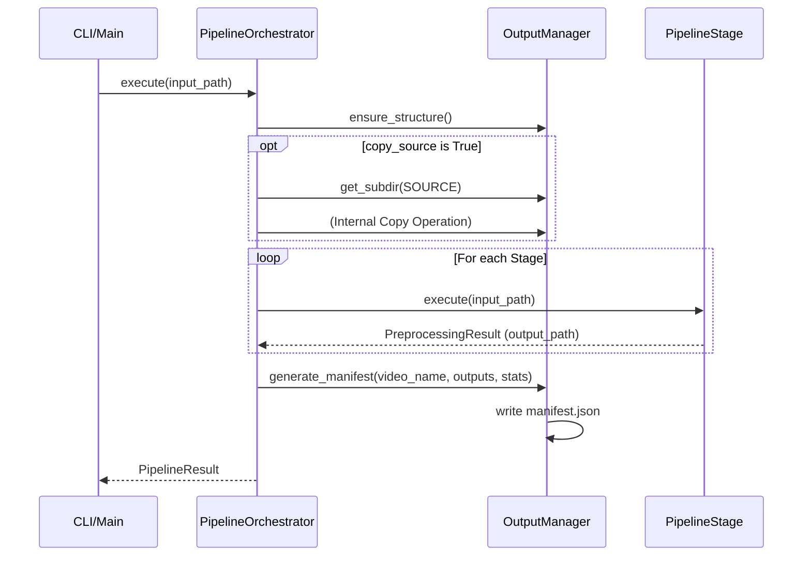

<details>
<summary>Relevant source files</summary>

The following files were used as context for generating this wiki page:
- [src/video_chapter_automater/output/manager.py](https://github.com/b08x/video-chapter-automater/blob/main/src/video_chapter_automater/output/manager.py)
- [src/video_chapter_automater/pipeline/orchestrator.py](https://github.com/b08x/video-chapter-automater/blob/main/src/video_chapter_automater/pipeline/orchestrator.py)
- [src/video_chapter_automater/pipeline/config.py](https://github.com/b08x/video-chapter-automater/blob/main/src/video_chapter_automater/pipeline/config.py)
- [src/video_chapter_automater/preprocessing/base.py](https://github.com/b08x/video-chapter-automater/blob/main/src/video_chapter_automater/preprocessing/base.py)
- [src/video_chapter_automater/cli_pipeline.py](https://github.com/b08x/video-chapter-automater/blob/main/src/video_chapter_automater/cli_pipeline.py)
- [tests/preprocessing/test_output_organization.py](https://github.com/b08x/video-chapter-automater/blob/main/tests/preprocessing/test_output_organization.py)
</details>

# Output Management

## Introduction
Output Management in the `video-chapter-automater` repository is a centralized mechanism designed to govern the lifecycle, organization, and validation of artifacts generated during the video preprocessing pipeline. It serves as the structural backbone for ensuring that disparate stages—such as video encoding, audio extraction, and scene detection—deposit their results into a predictable, hierarchical directory tree. The system relies on the `OutputManager` class to abstract filesystem operations, enforce naming conventions, and maintain a manifest of processing results.

## Architectural Structure and Data Flow
The system architecture centralizes file operations to prevent "spaghetti" directory structures. The `PipelineOrchestrator` initializes the `OutputManager`, which then dictates where every downstream component must write its data.

### The Output Hierarchy
The default root directory is `./vca_output/`, though this is configurable. Within this root, the system enforces a strict subdirectory mapping based on the `OutputType` enumeration.

| Output Type | Subdirectory | Purpose |
| :--- | :--- | :--- |
| `VIDEO` | `video/` | Re-encoded video files (GPU accelerated) |
| `AUDIO` | `audio/` | Extracted WAV files (16kHz mono) |
| `SCENES` | `scenes/` | Extracted scene images organized by video name |
| `CHAPTERS` | `chapters/` | FFmpeg metadata format marker files |
| `METADATA` | `metadata/` | JSON manifests and processing statistics |
| `LOGS` | `logs/` | Debug information and execution logs |
| `SOURCE` | `source/` | Optional copies of the original input files |

Sources: `src/video_chapter_automater/output/manager.py:#L66-L105`, `src/video_chapter_automater/pipeline/config.py:#L56-L59`

### Interaction Logic
The `OutputManager` is not merely a passive directory creator; it is an active validator and namer. It generates paths using a `{video_name}{suffix}.{extension}` pattern, ensuring consistency across different pipeline stages.

```python
# src/video_chapter_automater/output/manager.py
def get_output_path(
    self,
    video_name: str,
    output_type: OutputType,
    extension: str,
    suffix: str = ""
) -> Path:
    subdir_name = self.SUBDIRS[output_type]
    return self.base_dir / subdir_name / f"{video_name}{suffix}.{extension}"
```
Sources: `src/video_chapter_automater/output/manager.py:#L151-L168`

## Mechanism of Pipeline Integration
The `PipelineOrchestrator` acts as the primary consumer of the `OutputManager`. During execution, the orchestrator coordinates the flow of data from the input file through various `Stage` instances, eventually consolidating results into a final manifest.

### Sequence of Output Generation
The following diagram illustrates how the orchestrator interacts with the output system during a standard sequential execution.


Sources: `src/video_chapter_automater/pipeline/orchestrator.py:#L106-L150`, `src/video_chapter_automater/pipeline/orchestrator.py:#L174-L200`

## Validation and Metadata
The system implements a "trust but verify" approach to output files. The `validate_output` method checks not only for the existence of a file but also ensures it is a non-empty, valid file entity.

### Manifest Generation
Upon successful completion of all pipeline stages, the `OutputManager` (via the orchestrator) generates a JSON manifest. This file acts as the "source of truth" for the processing session, containing:
- Timestamps of execution.
- Relative paths to all generated artifacts.
- Processing statistics (total duration, individual stage times).

Sources: `src/video_chapter_automater/output/manager.py:#L130-L148`, `src/video_chapter_automater/pipeline/orchestrator.py:#L189-L205`

## Operational Tendencies and Observed Inconsistencies
The architecture presents an interesting contradiction: while the `OutputManager` is designed to be the central authority for file organization, individual preprocessing components like `VideoEncoder` and `AudioExtractor` still maintain internal logic for building FFmpeg commands that include output paths. 

The system relies on an optional `output_dir` parameter passed into these components to override their default behavior of writing to the source file's directory. If the orchestrator fails to pass this directory, the "centralized" management breaks down, and files are scattered—a shitty structural dependency that requires the orchestrator to be perfectly configured to maintain the intended order.

Sources: `tests/preprocessing/test_output_organization.py:#L25-L48`, `src/video_chapter_automater/pipeline/orchestrator.py:#L56-L70`

## Summary
Output Management in this system is a robust, albeit dependency-heavy, framework for artifact preservation. By enforcing a strict subdirectory schema and providing a unified interface for path generation and validation, it ensures that the high-volume data generated by video processing (scenes, audio, re-encoded video) remains navigable and verifiable. Its structural significance lies in its role as the final arbiter of pipeline success, signaled by the creation of the execution manifest.