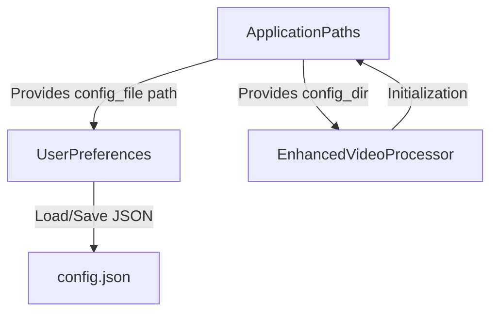
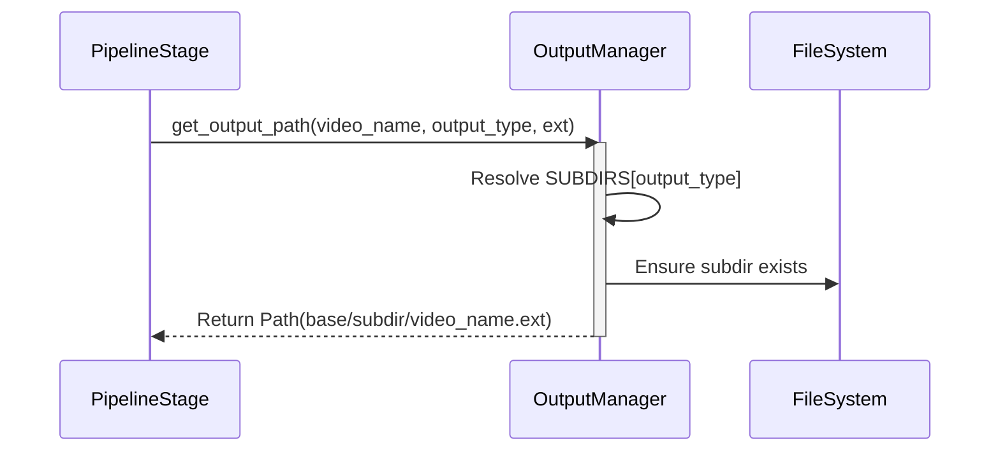

Relevant source files

The following files were used as context for generating this wiki page:
- [src/video_chapter_automater/app_paths.py](https://github.com/b08x/video-chapter-automater/blob/main/src/video_chapter_automater/app_paths.py)
- [src/video_chapter_automater/output/manager.py](https://github.com/b08x/video-chapter-automater/blob/main/src/video_chapter_automater/output/manager.py)
- [src/video_chapter_automater/setup_wizard.py](https://github.com/b08x/video-chapter-automater/blob/main/src/video_chapter_automater/setup_wizard.py)
- [src/video_chapter_automater/pipeline/config.py](https://github.com/b08x/video-chapter-automater/blob/main/src/video_chapter_automater/pipeline/config.py)
- [src/video_chapter_automater/main.py](https://github.com/b08x/video-chapter-automater/blob/main/src/video_chapter_automater/main.py)
- [tests/test_app_paths.py](https://github.com/b08x/video-chapter-automater/blob/main/tests/test_app_paths.py)

# Configuration & App Paths

## Introduction

The configuration and path management system in VideoChapterAutomater serves as the structural foundation for cross-platform persistence and artifact organization. It employs a multi-layered approach: platform-aware directory resolution for system-level configuration, a centralized `ApplicationPaths` coordinator, and a specialized `OutputManager` for process-specific artifacts. The system is designed to isolate application logic from OS-specific filesystem quirks, ensuring that configuration, cache, and data remain decoupled from the execution environment.

Sources: `src/video_chapter_automater/app_paths.py`, `src/video_chapter_automater/output/manager.py`

## Application Path Resolution

The `ApplicationPaths` class acts as the single source of truth for locating system directories. It leverages platform detection to resolve base paths for configuration, data, and caching.

### Platform-Specific Mapping

The system maps the application name `video-chapter-automater` to standard OS locations.

| Path Type | Linux | macOS | Windows |
| :--- | :--- | :--- | :--- |
| **Config** | `~/.config/` | `~/Library/Application Support/` | `%APPDATA%\` |
| **Data** | `~/.local/share/` | `~/Library/Application Support/` | `%LOCALAPPDATA%\` |
| **Cache** | `~/.cache/` | `~/Library/Caches/` | `%TEMP%\` |

Sources: `src/video_chapter_automater/app_paths.py:#L55-L75`, `tests/test_app_paths.py:#L55-L85`

### Structural Interaction Flow

The following diagram illustrates how `ApplicationPaths` provides the filesystem context to the `UserPreferences` and `EnhancedVideoProcessor`.

Sources: `src/video_chapter_automater/app_paths.py:#L31-L50`, `src/video_chapter_automater/main.py:#L77-L80`

## Configuration Mechanism

The system utilizes a `UserPreferences` dataclass to manage application state. This structure defines the operational constraints for the video processing pipeline.

### User Preferences Schema

| Field | Type | Default | Description |
| :--- | :--- | :--- | :--- |
| `installation_type` | `InstallationType` | `STANDARD` | Scope of the installation |
| `gpu_preference` | `str` | `"auto"` | Hardware acceleration target |
| `output_format` | `str` | `"mp4"` | Target container format |
| `scene_detection_threshold` | `float` | `30.0` | Sensitivity for scene changes |
| `enable_gpu_acceleration` | `bool` | `True` | Toggle for hardware usage |

Sources: `src/video_chapter_automater/setup_wizard.py:#L74-L85`

The system enforces validation during initialization. For instance, the `scene_detection_threshold` must be non-negative, and the `output_format` is restricted to a specific whitelist. If these invariants are violated, the system raises a `ValueError`, halting the configuration flow. This is a goddamn rigid check for a system that otherwise presents itself as highly flexible.

Sources: `src/video_chapter_automater/setup_wizard.py:#L87-L97`

## Output Directory Management

While `ApplicationPaths` handles system-level persistence, the `OutputManager` manages the "vca_output" directory structure where processing results are stored.

### Directory Hierarchy

The `OutputManager` enforces a strict subdirectory mapping via the `OutputType` enum:
- `video/`: Re-encoded video files.
- `audio/`: Extracted WAV files (16kHz mono).
- `scenes/`: Organized by video name.
- `chapters/`: FFmpeg metadata format.
- `metadata/`: JSON manifests and statistics.
- `logs/`: Debug information.

Sources: `src/video_chapter_automater/output/manager.py:#L105-L115`

### Path Generation Sequence

The `OutputManager` ensures that file naming is consistent across different processing stages.

Sources: `src/video_chapter_automater/output/manager.py:#L140-L165`

## Pipeline Configuration

The `PipelineConfig` class bridges the gap between user preferences and execution. It defines how stages (Encoding, Audio Extraction, Scene Extraction) are ordered and executed.

### Execution Modes

The system supports three execution strategies, though the implementation reveals a functional gap where `PARALLEL` currently defaults to `SEQUENTIAL` behavior—a somewhat deceptive structural placeholder.

1. **SEQUENTIAL**: Standard one-by-one execution.
2. **RESILIENT**: Continues execution even if individual stages fail.
3. **PARALLEL**: Future enhancement (currently routes to sequential logic).

Sources: `src/video_chapter_automater/pipeline/config.py:#L39-L50`, `src/video_chapter_automater/pipeline/orchestrator.py:#L105-L115`

## Structural Significance

The configuration and path management system provides a centralized, platform-agnostic interface that prevents the application from scattering files across the host system. By separating application paths (long-term config) from output paths (short-term artifacts), the architecture maintains a clean distinction between global state and per-project results. The reliance on `ApplicationPaths` for all directory resolution ensures that the entire system can be redirected (e.g., via `XDG_CONFIG_HOME`) without modifying individual components.

Sources: `src/video_chapter_automater/app_paths.py`, `src/video_chapter_automater/output/manager.py`, `README.md`